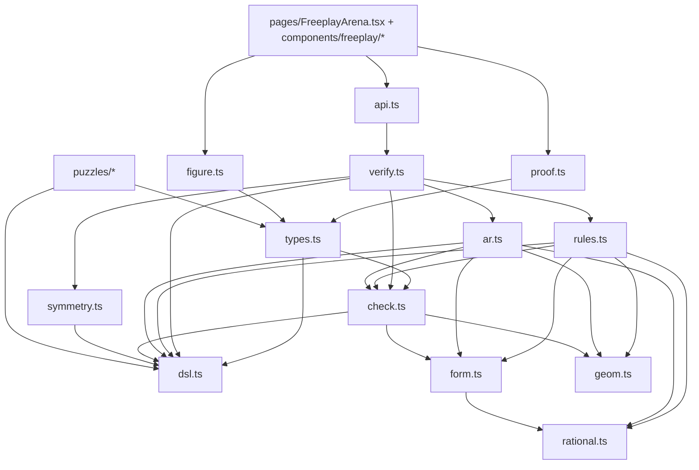

# DDAR Proof-Checker — Developer Technical Reference

_Authoritative internals doc for `src/lib/freeplay/`, the from-scratch DDAR
(Deductive Database + Algebraic Reasoning) geometry proof-checker that powers
Competitive Freeplay. Produced by a deep read-only audit (verified against the
source) and intended for future developers. Companion docs:
[`PRD-competitive-freeplay.md`](./PRD-competitive-freeplay.md) (design intent),
[`PROJECT_STATUS.md`](./PROJECT_STATUS.md) (§3 high-level), and the research lab
[`research/freeplay-rules/`](../research/freeplay-rules/)._

> Scope note: the shipped engine is a **cite-driven, single-step DD+AR verifier**
> with **multi-realization** numeric-truth gating, minimality enforcement, and
> "by symmetry" support — deliberately **not** a full DDAR closure solver. It
> checks one learner step at a time, but against **several independent generic
> realizations** of the figure (not one), so a coincidence in the canonical
> diagram cannot be exploited. Multi-hop search / hints / auxiliary constructions
> are out of scope today.

> Multi-case verification (this is the key soundness upgrade): each puzzle ships a
> parametric `construct(rng)` that re-samples generic figures satisfying its
> givens; `realize.ts` validates and collects them; `verify()` requires every step
> to be true AND one-step-derivable in **all** of them. A step is `not_true` if it
> fails in any realization, `unjustified` if the derivation fires only in some, and
> a premise is `extraneous` only if droppable in **all**. The same construction is
> the basis for the planned movable figures ([`design/MOVABLE_FIGURES.md`](./design/MOVABLE_FIGURES.md)).

---

## 1. Architecture

### 1.1 Module dependency graph



- **Leaf layer:** `rational.ts`, `geom.ts`
- **Foundation:** `dsl.ts`, `form.ts`, `check.ts`
- **Reasoning:** `rules.ts` (DD), `ar.ts` (AR)
- **Orchestration:** `verify.ts`, `symmetry.ts`
- **Integration:** `api.ts`, `proof.ts`, `figure.ts`, `types.ts`, `puzzles/*`

### 1.2 File responsibilities

| File | Role |
|------|------|
| `dsl.ts` | Fact AST (`Rel`, `Aval`), constructors, `RELS` metadata, canonical keys, labels |
| `types.ts` | `Puzzle`, `SolutionStep`, difficulty; ties coords/figure/givens/goal/solution |
| `form.ts` | Linear `Form` over rationals; angle tokens `#ang:…@…`; `parseForm` / `fstr` |
| `rational.ts` | Exact `Rat` arithmetic |
| `geom.ts` | 2D vectors, angles, collinearity, betweenness, rays, line intersection, circumcenter |
| `check.ts` | Numeric truth gate `factHolds`; `evalVars` / `angleVarValue` |
| `rules.ts` | 13 coordinate-guarded DD rules; `Rule.derive(cited, ctx) → Fact[]` |
| `ar.ts` | `AngleAR`: directed-angle Gaussian elimination mod 180° |
| `realize.ts` | `sampleRealizations`: seeded RNG + per-puzzle `construct` → N validated generic realizations |
| `verify.ts` | Step acceptance over N realizations: truth + one-step derivability + minimality; `deriveAll` |
| `symmetry.ts` | "By symmetry": point relabeling, givens automorphism check |
| `proof.ts` | Client proof state reducer (`initProofState`, `proofReducer`, `isGoal`) |
| `api.ts` | `verifyStep`: optional remote `/verify-step`, fallback to local `verify` |
| `figure.ts` | `buildFigureDef`: JSXGraph board from the canonical realization + figure elements |
| `types.ts` | `Puzzle` (incl. `construct`/`freePoints`), `Realization`, `SolutionStep` |
| `puzzles/*` | Curated problems + parametric `construct(rng)` builders (`*Config.ts`) |

### 1.3 Control flow: one proof-step verification

Entry: `verifyStep()` (`api.ts:43–55`) → local `verify()` unless `VITE_FREEPLAY_API_URL`
is set and the remote call succeeds. UI wiring is `FreeplayArena.tsx:80–118`.

```
verify(input)
├─ [analogy branch] symmetry checks (verify.ts:101–116)
│   ├─ isGivenSymmetry(subst, givens, points)
│   ├─ analogSource(candidate, subst, establishedFacts)
│   └─ factHolds(candidate) → { valid: true, rule: "by symmetry …" }
│
└─ [derive branch] (verify.ts:119–159)
    ├─ ∀ prem ∈ citedPremises: isAmong(prem, establishedFacts) → unknown_premise
    ├─ factHolds(candidate) → not_true
    ├─ dedupe cited by canonicalKey
    ├─ cited.length === 0 → unjustified
    ├─ deriveOnce(cited, candidate, ctx) → unjustified if null
    └─ ∀ leave-one-out subset: still derivable → extraneous_premises
        else → { valid: true, rule }
```

`deriveOnce()` (`verify.ts:72–95`): (1) `expandColls(cited)` injects all 3-point
sub-collinearities from variadic `coll`; (2) **DD pass** — each rule in `RULES`,
returning its `name` on the first `factEqual` match, otherwise accumulating every
output into `ddDerived`; (3) **AR pass** — build `AngleAR`, `add` every fact in
`[...expanded, ...ddDerived]`, and if `ar.implies(candidate)` return
`"algebraic angle-chase"`. Rule exceptions are swallowed (`try/catch continue`).

**Key invariants:** DD is tried before AR; first matching DD rule in array order
wins; AR sees cited facts **plus** all one-step DD consequences.

---

## 2. Fact language (DSL)

### 2.1 `Rel` relations (`dsl.ts:16–76`)

| Name | Arity | Meaning | Builder |
|------|-------|---------|---------|
| `coll` | 3+ (variadic) | All points on one line | `rel("coll", pts)` |
| `para` | 4 | AB ∥ CD | `rel("para", [A,B,C,D])` |
| `perp` | 4 | AB ⊥ CD | `rel("perp", [A,B,C,D])` |
| `cong` | 4 | AB = CD | `rel("cong", [A,B,C,D])` |
| `cyclic` | 4 | Four concyclic points | `rel("cyclic", [A,B,C,D])` |
| `midp` | 3 | M is midpoint of AB (M first) | `rel("midp", [M,A,B])` |
| `eqangle` | 6 | ∠(a,b,c) = ∠(d,e,f), vertices b,e | `rel("eqangle", [a,b,c,d,e,f])` |

**Not in the shipped DSL:** `eqratio`, `simtri`, `contri` (named in the PRD but
absent from `RelName` — see §7).

### 2.2 `Aval` angle values

`aval([arm, vertex, arm], form)` — measure of ∠(a,b,c) equals a linear `Form`
(`{ c: Rat, v: Record<string, Rat> }`) over named variables (per-puzzle, e.g. `"A"`)
and/or angle tokens (`parseForm("angle(A,O,C)")`).

### 2.3 Canonical keys (`dsl.ts:78–115`)

- **Angle key**: arms unordered, vertex fixed (∠ABC ≡ ∠CBA).
- `coll`/`cyclic`: sort all ids. `para`/`perp`/`cong`: sort endpoints in each pair,
  then sort the two pair-keys. `midp`: midpoint fixed, endpoints sorted. `eqangle`:
  two angle keys sorted. `aval`: `aval(<angleKey>=<fstr(form)>)`.
- `factEqual` uses `canonicalKey` for rels; for `aval` it also requires `feq` on forms.
- `isAmong` compares `canonicalKey` (used for premise membership + dedup).

### 2.4 Edge cases

- Variadic `coll` vs. 3-point rules: rules expecting exactly two on-line points are
  fed triples by `expandColls`; `pappus` only inspects exactly-3-point colls.
- `midp(M,A,B) ≠ midp(M,B,A)` canonically (correct — M fixed).
- `eqangle` is the 6-point (two-triple) form, **not** AG's 8-point directed-line form.
- A foreign `{ kind: "eqratio" }` cast to `Fact` hits the `aval` branch of
  `canonicalKey` and **throws** on `f.angle` — see §7.

---

## 3. Algorithms

### 3.1 AR — directed-angle table mod 180° (`ar.ts`)

Each line (keyed by unordered point-pair) gets an abstract direction variable
`L:x,y`; unknowns are linear expressions over exact rationals; the constant
generator `pi` = 180°. Equations contributed:

| Fact | Equation |
|------|----------|
| `para(A,B,C,D)` | D(AB) − D(CD) = 0 |
| `perp(A,B,C,D)` | D(AB) − D(CD) ± 90° = 0 |
| `eqangle` | difference of the two angle-diffs is 0 (equal) or ±180° (supplementary) |
| `aval` | `measure(angle) − formValue(form) = 0` |
| `coll` | (in `add`, not `equation`) all pairwise line directions equated |

**Why AR cannot _emit_ `coll`:** `equation()`'s switch handles only
`para`/`perp`/`eqangle`; `default` returns `null` for `coll`/`cong`/`cyclic`/`midp`
(`ar.ts:315–316`). Collinearity is _consumed_ in `add()` (merging direction vars,
`ar.ts:325–338`) but never produced. (This is the gap the research lab's Simson-line
work targets.)

Coordinates are used **only** to pick the sign ε∈{±1} and whole-turn integer j in
`measure()`/`pick()`/`balance()`, and to seed numeric slopes in `dir()` — never to
collapse variables. So the checker cannot read parallelism/collinearity "for free"
off the diagram; every used hypothesis must be cited. Tolerance `ZERO_DEG = 1e-3`.

Table closure (`Table.addExpr`) mirrors AlphaGeometry's `ar.py`: substitute bound
vars, then depending on the number of free vars either confirm/solve a constant
relation or bind a (dependent) variable.

### 3.2 DD rule loop

Within one step: facts are coll-expanded; each rule independently scans **only the
cited** facts and emits **all** instances its coordinate guards license. There is
**no** multi-hop DD fixpoint inside a step — exactly one DD application layer, then
optional AR over `cited ∪ ddDerived`.

**Shipped rules (13):** `inscribed_angle`, `collinear_same_ray`,
`angle_value_transfer`, `angle_value_equal`, `angle_addition`, `triangle_angle_sum`,
`straight_supplement`, `isosceles` (→`cong`), `midsegment` (→`para`),
`para_equal_angles`, `converse_inscribed` (→`cyclic`), `concyclic_merge` (→`cyclic`),
`pappus` (→`coll`/`para`). Output kinds: most produce `eqangle`/`aval`; only
`isosceles` produces `cong`; only `pappus` produces `coll`.

### 3.3 Minimality (`verify.ts:149–157`)

After a successful derivation, each cited premise is dropped in turn; if the
candidate still derives, the step is rejected as `extraneous_premises`. Prevents
"cite everything" cheating. (Exempt on the symmetry path.)

### 3.4 "By symmetry" (`symmetry.ts`)

A `Subst` of disjoint transpositions must (a) be an automorphism of the **givens**
(`isGivenSymmetry`) and (b) map some established fact onto the asserted fact
(`analogSource`); the consequence must also hold numerically. Soundness rests on
rules being relabeling-invariant, with `factHolds` as a backstop.

---

## 4. The verifier (`verify.ts`)

**Derive-mode acceptance (all required):** every cited fact is established
(`unknown_premise`), candidate is numerically true (`not_true`), non-empty cited set
after dedup (`unjustified`), one-step DD/AR derivability (`unjustified`), minimality
(`extraneous_premises`).

**Symmetry-mode acceptance:** givens automorphism (`not_symmetry`), an analog source
exists (`unjustified`), numeric truth (`not_true`). Premise establishment and
minimality are **not** checked here.

**Result type:** `{ valid: true; rule } | { valid: false; reason }` where reason ∈
`not_true | unknown_premise | unjustified | not_symmetry | extraneous_premises`.
(The PRD's "more than one step away" is folded into `unjustified`.)

`deriveAll()` enumerates DD-only consequences for the dev panel (no AR), filtering
already-known/false/duplicate facts.

---

## 5. Data flow

```
Puzzle module (puzzles/*.ts: coords, given[], goal, variables?, figure, construct?, freePoints?)
  → initProofState(puzzle)         facts[] seeded from givens (source:"given")
  → buildFigureDef(puzzle)         JSXGraphDef → FixedFigure (canonical realization)
  → sampleRealizations(puzzle)     N validated generic realizations (memoized per puzzle)
  → learner: StepBuilder           candidateFact + cited FactEntry ids
  → verifyStep({coords, bindings, establishedFacts, candidateFact,
                citedPremises, givens, analogy?, realizations}, puzzle.id) → VerifyResult
  → proofReducer                   accept → append derived FactEntry; isGoal → solved
```

`realizations` is the multi-case list (realization 0 = canonical `coords`/`variables`).
Omitting it falls back to the single canonical figure, so `verify()` is fully
backwards-compatible (every pre-existing test calls it without realizations).

The **remote** payload (`api.ts:21–40`) omits `bindings`, `givens`, and `analogy`
— so symmetry and bindings are effectively local-only unless a backend is extended.

---

## 6. Soundness & coordinate-guarding

Layers: (1) the **numeric truth gate** (`factHolds`/`factHoldsL`) blocks any fact
false in a realization; (2) **rule guards** (via `geom.ts`) only emit facts the
figure supports; (3) AR is cite-driven (coordinates only fix signs/branches); and
(4) the **multi-realization wrapper** (`realize.ts` + `verify.ts`) runs (1)–(3)
against several independent generic realizations and accepts only on unanimous
agreement. (4) is what closes the "true in one diagram by accident" gap: rule
guards and AR branch selection both read coordinates, so a single non-generic
figure could license a figure-specific step; requiring the step in **every**
sampled realization removes that. The per-puzzle `construct(rng)` builds those
realizations so the givens hold by construction (see `realize.ts`); samples that
are degenerate or violate a given are rejected and resampled.

**Tolerances in use:** `check.ts` EPS `1e-6` (most rels), `1e-3` (aval), `1e-4`
(eqangle); `geom.ts` `1e-9`–`1e-6`; `ar.ts` `ZERO_DEG = 1e-3`; assorted rule guards
`1e-3`–`1e-6`. **Risk:** these are inconsistent, so a borderline-degenerate figure
could pass one check and fail another. Mitigations: use generic/scalene coordinates
in puzzles and validate every given/step with `factHolds`.

Other noted risks: undirected DD vs directed AR mismatch; `factHolds` returns `true`
for a degenerate `coll` if two points coincide; `deriveAll`/DD emit without
minimality (dev only); Pappus-at-infinity requires a cited matching `para`; the UI
maps any thrown error to `unjustified`, which can mask config/parse failures.

---

## 7. Doc-vs-implementation discrepancies (reconcile when touching docs)

| Doc claim | Actual | Citation |
|-----------|--------|----------|
| PRD §3: reuse Python DDAR on Cloud Run | TS engine in browser; backend optional via env var, not deployed | `api.ts:4–6,47–54` |
| PRD §5.1: `eqangle` 8 points | 6 points (two angle triples) | `dsl.ts:9–10,71–75` |
| PRD §5.1: `eqratio`/`simtri` in client DSL | Not in `RelName` | `dsl.ts:16–23` |
| PRD §4.2: three reject reasons | Five (adds `unknown_premise`, `not_symmetry`, `extraneous_premises`) | `verify.ts:56–66` |
| PRD §4.2: distinct "more-than-one-step" reason | Folded into `unjustified` | `verify.ts:147` |
| PRD §13.1: "12 rules" | **13** rules | `rules.ts:557–571` |
| PRD §13.2: IMO 2019 P2 needs missing rules | Rules exist; the shipped puzzle's reference chain is just incomplete (`solutionReachesGoal:false`) | `imo2019p2.ts:57–60` |

---

## 8. Undocumented behavior, tech debt, limitations

- **`eqratio`/foreign fact kinds throw** in `canonicalKey` (aval branch reads
  `f.angle`). Harmless today (no ratios ship) but must be guarded before promoting
  ratios. (`dsl.ts:112–114`; research note `sas_similarity_problem.test.ts:142–143`.)
- **AR cannot emit `coll`** (§3.1) — only DD (`pappus`) produces collinearity.
- **`cong` produced only by `isosceles`**; `perp` is consumed, never produced.
- **Rule-order sensitivity**: the first matching rule wins and tests assert exact
  `rule.name` strings — array order in `rules.ts:557–571` is part of the contract.
- **Symmetry path ignores cited premises** (doesn't validate them against
  established facts).
- **Missing functionality:** length/ratio table (research-only), Pascal & the other
  unpromoted research rules, the full IMO 2019 P2 chain, hints/auxiliary
  constructions/AR traceback, and a complete remote-verify payload.
- No `TODO`/`FIXME` markers in `src/lib/freeplay/` — debt is architectural/content.

---

## 9. Extension points

**Add a DD rule:** implement `Rule { id, name, derive(cited, ctx) }`, filter cited
facts, guard with `geom.ts` + coords, push canonical facts via `rel()`/`aval()`,
append to the `RULES` array, and add Vitest (isolation + minimality + soundness
negative + puzzle replay). Keep it relabeling-invariant for `symmetry.ts`. Prototype
in `research/freeplay-rules/rules/` first, then promote.

**Add length/ratio support (the big one):** add `eqratio` to `RelName` + `relKey` +
`factHolds`; build a `LengthAR` (log-distance generators, mirrors `ar.ts`); extend
`deriveOnce` to run `LengthAR` after DD; **guard `canonicalKey` for the new kind**;
promote the research ratio rules; extend `RELS`/`StepBuilder` for 8-point ratio
slots. Numeric-constant ratios (`AB = 2·MA`) need explicit log generators and remain
out of scope. The research lab `research/freeplay-rules/lengths/` is the blueprint.
