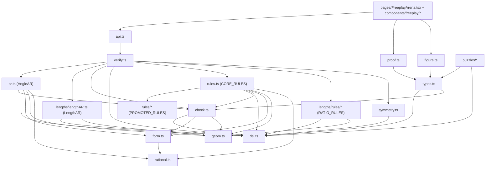

# DDAR Proof-Checker — Developer Technical Reference

_Authoritative internals doc for `src/lib/freeplay/`, the from-scratch DDAR
(Deductive Database + Algebraic Reasoning) geometry proof-checker that powers
Competitive Freeplay. Verified against the source. Companion docs:
[`FREEPLAY_EXPLAINER.md`](./FREEPLAY_EXPLAINER.md) (plain-language tour, start
there), [`PRD-competitive-freeplay.md`](./PRD-competitive-freeplay.md) (design
intent), [`PROJECT_STATUS.md`](./PROJECT_STATUS.md) (§3 high-level), the
natural-language input specs ([`design/NL_TO_DDAR.md`](./design/NL_TO_DDAR.md) /
[`design/NL_TO_DDAR_V2_OPENAI.md`](./design/NL_TO_DDAR_V2_OPENAI.md)), and the
research lab [`research/freeplay-rules/`](../research/freeplay-rules/)._

> Scope note: the shipped engine is a **cite-driven, single-step DD + AR +
> length/ratio verifier** with **multi-realization** numeric-truth gating,
> minimality enforcement, and "by symmetry" support — deliberately **not** a full
> DDAR closure solver. It checks one learner step at a time, but against **several
> independent generic realizations** of the figure (not one), so a coincidence in
> the canonical diagram cannot be exploited. Reasoning spans three layers — DD
> rules, the directed-angle table (`AngleAR`), and the log-distance ratio table
> (`LengthAR`). Multi-hop search / hints / auxiliary constructions are out of
> scope today.

> Multi-case verification (this is the key soundness upgrade): each puzzle ships a
> parametric `construct(rng)` that re-samples generic figures satisfying its
> givens; `realize.ts` validates and collects them; `verify()` requires every step
> to be true AND one-step-derivable in **all** of them. A step is `not_true` if it
> fails in any realization, `unjustified` if the derivation fires only in some, and
> a premise is `extraneous` only if droppable in **all**. The same construction is
> the basis for the planned movable figures ([`design/MOVABLE_FIGURES.md`](./design/MOVABLE_FIGURES.md)).

---

## 1. Architecture

### 1.1 Module dependency graph



- **Leaf layer:** `rational.ts`, `geom.ts`
- **Foundation:** `dsl.ts`, `form.ts`, `check.ts`
- **Reasoning:** `rules.ts` + `rules/*` (DD), `ar.ts` (AR), `lengths/*` (`LengthAR` + ratio rules)
- **Orchestration:** `verify.ts`, `symmetry.ts`
- **Integration:** `api.ts`, `proof.ts`, `proofRecord.ts`, `figure.ts`, `types.ts`, `puzzles/*`, `nl/*`

### 1.2 File responsibilities

| File | Role |
|------|------|
| `dsl.ts` | Fact AST (`Rel`, `Aval`, `EqRatio`), `Fact`/`LFact` unions, constructors, `RELS` metadata, canonical keys, labels |
| `types.ts` | `Puzzle`, `SolutionStep`, difficulty; ties coords/figure/givens/goal/solution |
| `form.ts` | Linear `Form` over rationals; angle tokens `#ang:…@…`; `parseForm` / `fstr` |
| `rational.ts` | Exact `Rat` arithmetic |
| `geom.ts` | 2D vectors, angles, collinearity, betweenness, rays, line intersection, circumcenter |
| `check.ts` | Numeric truth gate `factHolds`; `evalVars` / `angleVarValue` |
| `rules.ts` | The angle/incidence DD rules: 13 hand-written `CORE_RULES` + the promoted `rules/*`, composed as `RULES`; `Rule.derive(cited, ctx) → Fact[]` |
| `rules/*` | 13 DD rules promoted from the research lab (`PROMOTED_RULES`): `midpoint_congruence`, `cong_transitivity`, `perp_bisector`, `isosceles_converse`, `sas_congruence`, `sas_shared_vertex`, `sss_congruence`, `shared_side_congruence`, `concyclic_equal_radii`, `pascal`, `coincident_direction_collinear`, `concyclic_from_directed_angles`, `thales_diameter` |
| `lengths/*` | Length/ratio subsystem: `dsl.ts` (`EqRatio`/`factHoldsL`/`LRule`), `lengthAR.ts` (`LengthAR`, unsigned log-distance table), and `rules/*` — 5 `RATIO_RULES` (`similar_triangles_aa`, `thales_basic_proportionality`, `sas_similarity`, `power_of_a_point`, `tangent_secant_power`) |
| `ar.ts` | `AngleAR`: directed-angle Gaussian elimination mod 180° |
| `realize.ts` | `sampleRealizations`: seeded RNG + per-puzzle `construct` → N validated generic realizations (`DEFAULT_REALIZATIONS = 5`) |
| `verify.ts` | Step acceptance over N realizations: truth + one-step derivability (DD/AR/LengthAR over `ALL_RULES = [...RULES, ...RATIO_RULES]`) + minimality; `deriveAll` |
| `symmetry.ts` | "By symmetry": point relabeling, givens automorphism check |
| `proof.ts` | Client proof state reducer (`initProofState`, `proofReducer`, `isGoal`) |
| `proofRecord.ts` / `useProofRecorder.ts` | Compile the finished proof to a JSON-safe `CompiledProof` on win and persist it (Firestore for signed-in users, `localStorage` for guests) |
| `nl/*` | Natural-language step input (off by default): `mock.ts` (offline keyword translator), `firebase.ts` (OpenAI-backed callable), `index.ts` (`getTranslator`), `map.ts` (descriptor → `LFact` lowerer/validator), `types.ts` |
| `api.ts` | `verifyStep`: optional remote `/verify-step`, fallback to local `verify` |
| `figure.ts` | `buildFigureDef`: JSXGraph board from the canonical realization + figure elements |
| `types.ts` | `Puzzle` (incl. `construct`/`freePoints`), `Realization`, `SolutionStep` |
| `puzzles/*` | 14 curated problems + parametric `construct(rng)` builders (`*Config.ts`) |

### 1.3 Control flow: one proof-step verification

Entry: `verifyStep()` (`api.ts:43–55`) → local `verify()` unless `VITE_FREEPLAY_API_URL`
is set and the remote call succeeds. UI wiring is `FreeplayArena.tsx:80–118`.

```
verify(input)
├─ [analogy branch] symmetry checks (verify.ts:101–116)
│   ├─ isGivenSymmetry(subst, givens, points)
│   ├─ analogSource(candidate, subst, establishedFacts)
│   └─ factHolds(candidate) → { valid: true, rule: "by symmetry …" }
│
└─ [derive branch] (verify.ts:119–159)
    ├─ ∀ prem ∈ citedPremises: isAmong(prem, establishedFacts) → unknown_premise
    ├─ factHolds(candidate) → not_true
    ├─ dedupe cited by canonicalKey
    ├─ cited.length === 0 → unjustified
    ├─ deriveOnce(cited, candidate, ctx) → unjustified if null
    └─ ∀ leave-one-out subset: still derivable → extraneous_premises
        else → { valid: true, rule }
```

`deriveOnce()`: (0) split cited into `ordinary` facts and `citedRatios`
(`eqratio`, also exposed to rules via `ctx.citedRatios` so a length rule can
*require* a proportion be cited rather than read off coordinates); (1)
`expandColls(ordinary)` injects all 3-point sub-collinearities from variadic
`coll`; (2) **DD pass** — each rule in `ALL_RULES` (`RULES` + `RATIO_RULES`),
returning its `name` on the first `factEqual` match, else accumulating ordinary
outputs into `ddDerived` and `eqratio` outputs into `lDerived`; (3) **AngleAR pass**
(skipped for an `eqratio` candidate) — build `AngleAR`, `add` every fact in
`[...expanded, ...ddDerived]`, and if `ar.implies(candidate)` return
`"algebraic angle-chase"`; (4) **LengthAR pass** — build `LengthAR`, `add`
`[...cited, ...ddDerived, ...lDerived]`, and if `lar.implies(candidate)` return
`"algebraic length-chase"`. Rule exceptions are swallowed (`try/catch continue`).

**Key invariants:** DD is tried before AR; first matching DD rule in array order
wins; AngleAR sees cited facts **plus** all one-step DD consequences; LengthAR
additionally sees the one-step `eqratio` consequences.

---

## 2. Fact language (DSL)

### 2.1 `Rel` relations (`dsl.ts:16–76`)

| Name | Arity | Meaning | Builder |
|------|-------|---------|---------|
| `coll` | 3+ (variadic) | All points on one line | `rel("coll", pts)` |
| `para` | 4 | AB ∥ CD | `rel("para", [A,B,C,D])` |
| `perp` | 4 | AB ⊥ CD | `rel("perp", [A,B,C,D])` |
| `cong` | 4 | AB = CD | `rel("cong", [A,B,C,D])` |
| `cyclic` | 4 | Four concyclic points | `rel("cyclic", [A,B,C,D])` |
| `midp` | 3 | M is midpoint of AB (M first) | `rel("midp", [M,A,B])` |
| `eqangle` | 6 | ∠(a,b,c) = ∠(d,e,f), vertices b,e | `rel("eqangle", [a,b,c,d,e,f])` |

**`eqratio` (the length/ratio fact)** is *not* a `Rel`: it is a separate
`EqRatio` kind (`dsl.ts`), `eqratio(A,B,C,D,E,F,G,H)` meaning `AB/CD = EF/GH`,
carried in the additive `LFact = Fact | EqRatio` union. `canonicalKey`,
`factEqual`, `isAmong`, and `factLabel` all handle it explicitly (it is consumed
by `LengthAR`, not the angle rules). **Still not in the DSL:** `simtri`, `contri`
(named in the PRD but absent — see §7).

### 2.2 `Aval` angle values

`aval([arm, vertex, arm], form)` — measure of ∠(a,b,c) equals a linear `Form`
(`{ c: Rat, v: Record<string, Rat> }`) over named variables (per-puzzle, e.g. `"A"`)
and/or angle tokens (`parseForm("angle(A,O,C)")`).

### 2.3 Canonical keys (`dsl.ts:78–115`)

- **Angle key**: arms unordered, vertex fixed (∠ABC ≡ ∠CBA).
- `coll`/`cyclic`: sort all ids. `para`/`perp`/`cong`: sort endpoints in each pair,
  then sort the two pair-keys. `midp`: midpoint fixed, endpoints sorted. `eqangle`:
  two angle keys sorted. `aval`: `aval(<angleKey>=<fstr(form)>)`.
- `factEqual` uses `canonicalKey` for rels; for `aval` it also requires `feq` on forms.
- `isAmong` compares `canonicalKey` (used for premise membership + dedup).

### 2.4 Edge cases

- Variadic `coll` vs. 3-point rules: rules expecting exactly two on-line points are
  fed triples by `expandColls`; `pappus` only inspects exactly-3-point colls.
- `midp(M,A,B) ≠ midp(M,B,A)` canonically (correct — M fixed).
- `eqangle` is the 6-point (two-triple) form, **not** AG's 8-point directed-line form.
- `canonicalKey` now has an explicit `eqratio` branch (`eqratioKey`, canonicalizing
  the four ratio symmetries), so an `eqratio`-shaped fact is keyed correctly rather
  than crashing the `aval` branch (the historical throw noted in earlier audits is
  fixed).

---

## 3. Algorithms

### 3.1 AR — directed-angle table mod 180° (`ar.ts`)

Each line (keyed by unordered point-pair) gets an abstract direction variable
`L:x,y`; unknowns are linear expressions over exact rationals; the constant
generator `pi` = 180°. Equations contributed:

| Fact | Equation |
|------|----------|
| `para(A,B,C,D)` | D(AB) − D(CD) = 0 |
| `perp(A,B,C,D)` | D(AB) − D(CD) ± 90° = 0 |
| `eqangle` | difference of the two angle-diffs is 0 (equal) or ±180° (supplementary) |
| `aval` | `measure(angle) − formValue(form) = 0` |
| `coll` | (in `add`, not `equation`) all pairwise line directions equated |

**Why AR cannot _emit_ `coll`:** `equation()`'s switch handles only
`para`/`perp`/`eqangle`; `default` returns `null` for `coll`/`cong`/`cyclic`/`midp`
(`ar.ts:315–316`). Collinearity is _consumed_ in `add()` (merging direction vars,
`ar.ts:325–338`) but never produced. The DD rule `coincident_direction_collinear`
(`para(X,A,X,B) ⇒ coll(X,A,B)`) bridges this gap — it packages a proven shared
direction back into a `coll`, which is what closes the Simson–Wallace line.

Coordinates are used **only** to pick the sign ε∈{±1} and whole-turn integer j in
`measure()`/`pick()`/`balance()`, and to seed numeric slopes in `dir()` — never to
collapse variables. So the checker cannot read parallelism/collinearity "for free"
off the diagram; every used hypothesis must be cited. Tolerance `ZERO_DEG = 1e-3`.

Table closure (`Table.addExpr`) mirrors AlphaGeometry's `ar.py`: substitute bound
vars, then depending on the number of free vars either confirm/solve a constant
relation or bind a (dependent) variable.

### 3.2 DD rule loop

Within one step: facts are coll-expanded; each rule independently scans **only the
cited** facts and emits **all** instances its coordinate guards license. There is
**no** multi-hop DD fixpoint inside a step — exactly one DD application layer, then
optional AR over `cited ∪ ddDerived`.

**Shipped rules (31 total = 26 angle/incidence + 5 length/ratio).**

*Core angle/incidence (13, `CORE_RULES` in `rules.ts`):* `inscribed_angle`,
`collinear_same_ray`, `angle_value_transfer`, `angle_value_equal`, `angle_addition`,
`triangle_angle_sum`, `straight_supplement`, `isosceles` (→`cong`), `midsegment`
(→`para`), `para_equal_angles`, `converse_inscribed` (→`cyclic`), `concyclic_merge`
(→`cyclic`), `pappus` (→`coll`/`para`).

*Promoted angle/incidence (13, `PROMOTED_RULES` in `rules/`):* `midpoint_congruence`
(→`cong`), `cong_transitivity` (→`cong`), `perp_bisector` (→`cong`),
`isosceles_converse` (→`eqangle`), `sas_congruence` (→`cong`), `sas_shared_vertex`
(→`cong`), `sss_congruence` (→`eqangle`), `shared_side_congruence` (→`eqangle`),
`concyclic_equal_radii` (→`cyclic`), `pascal` (→`coll`/`para`),
`coincident_direction_collinear` (→`coll`), `concyclic_from_directed_angles`
(→`cyclic`), `thales_diameter` (→`perp`).

`RULES = [...CORE_RULES, ...PROMOTED_RULES]`. Output kinds: most produce
`eqangle`/`aval`; `coll` is produced only by `pappus`, `pascal`, and
`coincident_direction_collinear`; `cyclic` by `converse_inscribed`,
`concyclic_merge`, `concyclic_equal_radii`, and `concyclic_from_directed_angles`;
`perp` by `thales_diameter`.

*Length/ratio (5, `RATIO_RULES` in `lengths/rules/`):* `similar_triangles_aa`,
`thales_basic_proportionality`, `sas_similarity`, `power_of_a_point`,
`tangent_secant_power` — each emits `eqratio` (and `sas_similarity` also `eqangle`).
`verify()` runs these as `ALL_RULES = [...RULES, ...RATIO_RULES]`, routing the
`eqratio` outputs through the `LengthAR` length-chase branch (§3.5).

### 3.3 Minimality (`verify.ts:149–157`)

After a successful derivation, each cited premise is dropped in turn; if the
candidate still derives, the step is rejected as `extraneous_premises`. Prevents
"cite everything" cheating. (Exempt on the symmetry path.)

### 3.4 "By symmetry" (`symmetry.ts`)

A `Subst` of disjoint transpositions must (a) be an automorphism of the **givens**
(`isGivenSymmetry`) and (b) map some established fact onto the asserted fact
(`analogSource`); the consequence must also hold numerically. Soundness rests on
rules being relabeling-invariant, with `factHolds` as a backstop.

### 3.5 LengthAR — log-distance ratio table (`lengths/lengthAR.ts`)

The length/ratio dual of `AngleAR`: a Gaussian-elimination table whose generators
are the **unsigned** `log|PQ|` of each segment. `cong`/`eqratio`/`midp` premises
become linear equalities over those logs, and a candidate `eqratio` is accepted if
it is a linear consequence ("algebraic length-chase"). `deriveOnce` runs the DD
length rules (`RATIO_RULES`) and then `LengthAR` after the angle DD/AR passes;
`verify()`'s numeric truth gate uses `factHoldsL` for `eqratio` facts. Because the
table is **unsigned**, it cannot represent signed ratios (Menelaus/Ceva) or
numeric-constant ratios (`AB = 2·MA`) — see §8.

---

## 4. The verifier (`verify.ts`)

**Derive-mode acceptance (all required):** every cited fact is established
(`unknown_premise`), candidate is numerically true (`not_true`), non-empty cited set
after dedup (`unjustified`), one-step DD/AR derivability (`unjustified`), minimality
(`extraneous_premises`).

**Symmetry-mode acceptance:** givens automorphism (`not_symmetry`), an analog source
exists (`unjustified`), numeric truth (`not_true`). Premise establishment and
minimality are **not** checked here.

**Result type:** `{ valid: true; rule } | { valid: false; reason }` where reason ∈
`not_true | unknown_premise | unjustified | not_symmetry | extraneous_premises`.
(The PRD's "more than one step away" is folded into `unjustified`.)

`deriveAll()` enumerates DD-only consequences for the dev panel (no AR), filtering
already-known/false/duplicate facts.

---

## 5. Data flow

```
Puzzle module (puzzles/*.ts: coords, given[], goal, variables?, figure, construct?, freePoints?)
  → initProofState(puzzle)         facts[] seeded from givens (source:"given")
  → buildFigureDef(puzzle)         JSXGraphDef → FixedFigure (canonical realization)
  → sampleRealizations(puzzle)     N validated generic realizations (memoized per puzzle)
  → learner: StepBuilder           candidateFact + cited FactEntry ids
  → verifyStep({coords, bindings, establishedFacts, candidateFact,
                citedPremises, givens, analogy?, realizations}, puzzle.id) → VerifyResult
  → proofReducer                   accept → append derived FactEntry; isGoal → solved
```

`realizations` is the multi-case list (realization 0 = canonical `coords`/`variables`).
Omitting it falls back to the single canonical figure, so `verify()` is fully
backwards-compatible (every pre-existing test calls it without realizations).

The **remote** payload (`api.ts:21–40`) omits `bindings`, `givens`, and `analogy`
— so symmetry and bindings are effectively local-only unless a backend is extended.

---

## 6. Soundness & coordinate-guarding

Layers: (1) the **numeric truth gate** (`factHolds`/`factHoldsL`) blocks any fact
false in a realization; (2) **rule guards** (via `geom.ts`) only emit facts the
figure supports; (3) AR is cite-driven (coordinates only fix signs/branches); and
(4) the **multi-realization wrapper** (`realize.ts` + `verify.ts`) runs (1)–(3)
against several independent generic realizations and accepts only on unanimous
agreement. (4) is what closes the "true in one diagram by accident" gap: rule
guards and AR branch selection both read coordinates, so a single non-generic
figure could license a figure-specific step; requiring the step in **every**
sampled realization removes that. The per-puzzle `construct(rng)` builds those
realizations so the givens hold by construction (see `realize.ts`); samples that
are degenerate or violate a given are rejected and resampled.

**Tolerances in use:** `check.ts` EPS `1e-6` (most rels), `1e-3` (aval), `1e-4`
(eqangle); `geom.ts` `1e-9`–`1e-6`; `ar.ts` `ZERO_DEG = 1e-3`; assorted rule guards
`1e-3`–`1e-6`. **Risk:** these are inconsistent, so a borderline-degenerate figure
could pass one check and fail another. Mitigations: use generic/scalene coordinates
in puzzles and validate every given/step with `factHolds`.

Other noted risks: undirected DD vs directed AR mismatch; `factHolds` returns `true`
for a degenerate `coll` if two points coincide; `deriveAll`/DD emit without
minimality (dev only); Pappus-at-infinity requires a cited matching `para`; the UI
maps any thrown error to `unjustified`, which can mask config/parse failures.

---

## 7. Doc-vs-implementation discrepancies (reconcile when touching docs)

| Doc claim | Actual | Citation |
|-----------|--------|----------|
| PRD §3/§6–7: reuse Python DDAR on Cloud Run | TS engine in browser; remote `/verify-step` is an optional env-gated path, not deployed (PRD §13.3 documents this) | `api.ts:4–6,47–54` |
| PRD §5.1: `eqangle` 8 points | 6 points (two angle triples) | `dsl.ts` |
| PRD §5.1: `simtri`/`contri` in client DSL | Absent. (`eqratio` **is** now shipped as the `EqRatio` kind in `LFact`.) | `dsl.ts` |
| PRD §4.2: three reject reasons | Five (adds `unknown_premise`, `not_symmetry`, `extraneous_premises`) | `verify.ts` |
| PRD §4.2: distinct "more-than-one-step" reason | Folded into `unjustified` | `verify.ts` |

---

## 8. Undocumented behavior, tech debt, limitations

- **AR cannot emit `coll`** (§3.1) — only DD produces collinearity (`pappus`,
  `pascal`, `coincident_direction_collinear`).
- **`cong` producers:** `isosceles`, `midpoint_congruence`, `cong_transitivity`,
  `perp_bisector`, `sas_congruence`, `sas_shared_vertex`. **`perp`** is now produced
  by `thales_diameter` (previously only consumed).
- **`LengthAR` is unsigned** — no signed ratios (Menelaus/Ceva) and no
  numeric-constant ratios (`AB = 2·MA`, needs a `log 2` generator). See §3.5.
- **Converse power-of-a-point ⇒ `cyclic` is blocked** by the verifier derive
  contract: `deriveOnce` strips `eqratio` premises before calling `rule.derive` (they
  are consumed only by `LengthAR`), so a DD rule cannot *read* an `eqratio`. Unblocking
  it needs a shared-harness change (pass `eqratio` premises into `rule.derive`).
- **Rule-order sensitivity**: the first matching rule wins and tests assert exact
  `rule.name` strings — the order of `CORE_RULES` (`rules.ts`), `PROMOTED_RULES`
  (`rules/index.ts`), and `RATIO_RULES` (`lengths/rules/index.ts`) is part of the contract.
- **Symmetry path ignores cited premises** (doesn't validate them against
  established facts).
- **Still missing:** signed-length subsystem (Menelaus/Ceva), numeric-constant
  ratios, pole–polar / radical-axis representations, hints / auxiliary constructions /
  AR traceback ("why"), and a complete remote-verify payload. (Length/ratio reasoning,
  Pascal, and the full IMO 2019 P2 chain are now **shipped**, not gaps.)
- No `TODO`/`FIXME` markers in `src/lib/freeplay/` — debt is architectural/content.

---

## 9. Extension points

**Add an angle/incidence DD rule:** implement `Rule { id, name, derive(cited, ctx) }`,
filter cited facts, guard with `geom.ts` + coords, push canonical facts via
`rel()`/`aval()`, then **import it into `rules/index.ts` and append to
`PROMOTED_RULES`** (no other shipped file needs editing — `rules.ts` composes
`RULES = [...CORE_RULES, ...PROMOTED_RULES]`). Add Vitest (isolation + minimality +
soundness negative + puzzle replay). Keep it relabeling-invariant for `symmetry.ts`.
Prototype in `research/freeplay-rules/rules/` first, then promote.

**Add a length/ratio rule:** the subsystem already ships (`lengths/`). Implement an
`LRule` that emits `eqratio` (guard with `geom.ts`, gate with `factHoldsL`), import it
into `lengths/rules/index.ts`, and append to `RATIO_RULES`; `verify()` runs it via
`ALL_RULES` and routes the output through `LengthAR`. Prototype in
`research/freeplay-rules/lengths/rules/` first.

**Bigger extensions (not yet built):** a **signed** length table for Menelaus/Ceva
and external division (LengthAR is unsigned); numeric-constant ratios (a `log 2`
generator); and feeding `eqratio` premises into `rule.derive` to unlock converse
power-of-a-point ⇒ `cyclic`. See §8 and the research lab's
`findings/unsolved-rules-plan.md`.
