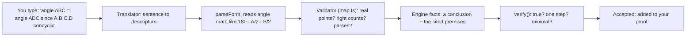
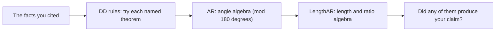
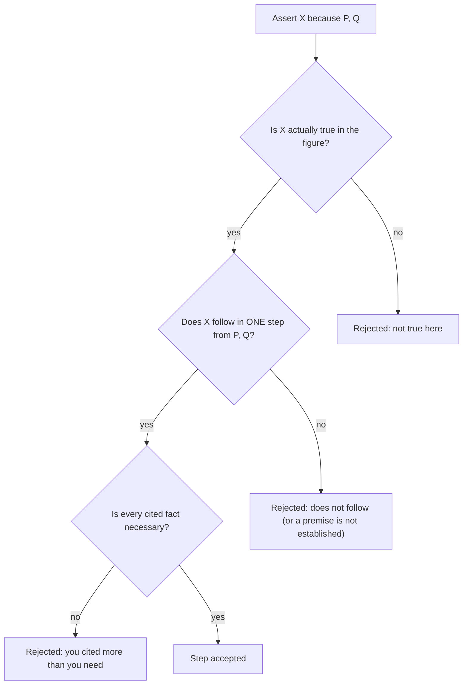
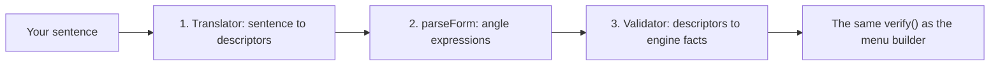

# Freeplay in Simple Terms: The DDAR Engine and the Step Parser

_A plain-language tour of how Competitive Freeplay works, for newcomers and
non-specialists. It covers two things: the **DDAR engine** (the proof-checker
that decides whether a step is valid) and the **geometry parser** (the part that
turns what you type into something the engine can check)._

_Want the deep, code-level detail instead? See the technical reference
[`docs/DDAR_ENGINE.md`](./DDAR_ENGINE.md) and the parser design specs
[`docs/design/NL_TO_DDAR.md`](./design/NL_TO_DDAR.md) /
[`docs/design/NL_TO_DDAR_V2_OPENAI.md`](./design/NL_TO_DDAR_V2_OPENAI.md)._

---

## The big picture

Competitive Freeplay is a mode where you **prove a geometry theorem one step at a
time**, and the app checks each step. Think of it like a spell-checker, but for
math reasoning: you write "this follows because of that," and the engine says
either "yes, accepted" or "no, and here's why."

The most important idea: **the engine is a checker, not a solver.** It does not
find the proof for you. It verifies the single step you just claimed.

Two pieces work together every time you submit a step:

1. The **parser** turns your input (typed words, or menu choices) into precise
   **facts**.
2. The **DDAR engine** decides whether your claimed step is a valid one-step
   deduction from the facts you cited.

Here is the whole journey of one typed step:

Part 1 below explains the engine (the `verify()` box). Part 2 explains the
parser (everything before it).

---

## Part 1: The DDAR engine (the proof-checker)

### What "DDAR" means

DDAR stands for **Deductive Database + Algebraic Reasoning** — the two ways the
engine reasons:

- **DD (Deductive Database):** a library of named geometry theorems (inscribed
  angle, isosceles triangle, midsegment, and so on). Each one looks at the facts
  you cited and tries to produce a new fact.
- **AR (Algebraic Reasoning):** instead of named theorems, this does plain
  algebra on angles (and, separately, on lengths) to chase equalities
  automatically.

### The vocabulary: everything is a "fact"

Before the engine can reason, your statement becomes a **fact** in a small fixed
vocabulary. These are the building blocks (see
[`src/lib/freeplay/dsl.ts`](../src/lib/freeplay/dsl.ts)):

| Fact | Points | Plain meaning |
|------|--------|---------------|
| `coll` | 3 or more | These points lie on one straight line |
| `para` | 4 | Line AB is parallel to line CD |
| `perp` | 4 | Line AB is perpendicular to line CD |
| `cong` | 4 | Segment AB has the same length as CD |
| `cyclic` | 4 | These four points lie on one circle |
| `midp` | 3 | M is the midpoint of AB |
| `eqangle` | 6 | Angle ABC equals angle DEF |
| angle value (`aval`) | 3 + expression | A specific angle equals an expression, e.g. `180 - A/2 - B/2` |
| ratio (`eqratio`) | 8 | A length proportion: `AB/CD = EF/GH` |

That's the entire language. Every given, every step, and every goal is just a
combination of these.

### Two ways it reasons

When you cite some facts and claim a new one, the engine tries to derive your
claim using, in order:

1. **DD rules** ([`src/lib/freeplay/rules.ts`](../src/lib/freeplay/rules.ts) and
   [`src/lib/freeplay/rules/`](../src/lib/freeplay/rules/)). This is a library of
   **31** named theorems today: a 13-rule hand-written core (inscribed angle,
   triangle angle sum, isosceles, midsegment, Pappus, ...), 13 more promoted from
   the research lab (congruence rules like SAS/SSS, Pascal, concyclic-from-equal-
   radii, ...), and 5 length/ratio rules (similar triangles, Thales, power of a
   point, ...). Each rule looks **only at the facts you cited** and is
   **coordinate-guarded** — it fires only when the actual figure supports it.

2. **AR — angle algebra** ([`src/lib/freeplay/ar.ts`](../src/lib/freeplay/ar.ts)).
   This treats each line's direction as an unknown and solves linear equations
   "mod 180 degrees." It can chase any chain of angle equalities automatically,
   so most ordinary **angle chasing needs no specific named rule** — the algebra
   just works it out.

3. **LengthAR — length algebra**
   ([`src/lib/freeplay/lengths/`](../src/lib/freeplay/lengths/)). The same trick,
   but for lengths and ratios (it works with the logarithms of distances). This
   is how equal-length chains and proportions get verified.

### How a step is judged: the 3 gates

When you assert "**X**, because of facts **P** and **Q**," the engine checks the
step against **three gates** (in
[`src/lib/freeplay/verify.ts`](../src/lib/freeplay/verify.ts)). All three must
pass:

1. **True?** X must actually hold in the figure. If not, you get *not true here*.
2. **Follows in one step?** X must be derivable from exactly the facts you cited,
   using one rule or one algebra pass. If it is true but doesn't follow (or is
   several steps away), you get *unjustified*. If you cite a fact you haven't
   established yet, you get *unknown premise*.
3. **Minimal?** Every fact you cited must be needed. If the step still works after
   dropping one of your premises, you get *extraneous premises* — this stops
   "cite everything and hope" cheating.

There's also a **"by symmetry"** shortcut: if your problem's setup is symmetric,
you can justify a step by pointing at an earlier, mirror-image step instead of
re-deriving it. (If the relabeling isn't actually a symmetry, you get *not
symmetry*.)

### No cheating off the diagram

Here is the clever part. A single drawing can lie: two angles might *look* equal
just because of how that one picture happened to be drawn. So the engine does
**not** trust one drawing.

Instead it **redraws the figure several different random ways** (5 by default),
each one still satisfying the problem's givens, and requires your step to pass in
**every** redraw (see
[`src/lib/freeplay/realize.ts`](../src/lib/freeplay/realize.ts)). A real theorem
survives all of them; a lucky coincidence gets caught in one of them and the step
is rejected.

Coordinates are used only to (a) check whether a fact is true and (b) pick the
right branch of the angle algebra — they are **never** used to hand you a fact you
didn't cite. You always have to state your reasons.

### A tiny worked example

Figure: points A, B, C, D all lie on one circle. You claim:

> ∠ABD = ∠ACD, because A, B, C, D are concyclic.

- **Gate 1 (true?):** In every redraw of four points on a circle, those two
  angles are equal. Pass.
- **Gate 2 (one step?):** The inscribed-angle rule (or the angle algebra) turns
  "concyclic" into "equal angles standing on the same arc" in a single step. Pass.
- **Gate 3 (minimal?):** The `cyclic` fact is genuinely needed, and nothing extra
  was cited. Pass.

Result: accepted, and the new equal-angle fact joins your proof.

---

## Part 2: The freeplay geometry parser (turning words into facts)

### Why it exists

You *can* build a step by picking a relation and its points from menus, but that
is slow. The parser lets you type a step in near-plain English, like:

> "angle ABC = angle ADC since A, B, C, D are concyclic"

and it figures out the **conclusion** (`angle ABC = angle ADC`) and the
**cited premise** (`A, B, C, D concyclic`) as engine facts.

### The pipeline, stage by stage

**Stage 1 — the Translator.** It reads your sentence and produces simple
**descriptors** (just a relation name plus point labels, or an angle plus an
expression string). There are two interchangeable backends, both emitting the
exact same descriptor format (see
[`src/lib/freeplay/nl/index.ts`](../src/lib/freeplay/nl/index.ts)):

- **Mock translator (the default, offline):** a small keyword grammar
  ([`src/lib/freeplay/nl/mock.ts`](../src/lib/freeplay/nl/mock.ts)). It needs no
  network and always behaves the same way, so it's used in development, in tests,
  and for signed-out guests.
- **OpenAI translator (signed-in only):** a cloud function that holds the API key
  on the server ([`src/lib/freeplay/nl/firebase.ts`](../src/lib/freeplay/nl/firebase.ts)).
  It understands richer, free-form English.

**Stage 2 — the expression parser
([`src/lib/freeplay/form.ts`](../src/lib/freeplay/form.ts), `parseForm`).** When
a step sets an angle equal to a formula — like `180 - A/2 - B/2` or
`angle(B,I,A)` — that little bit of math is parsed into a tidy linear expression.
It's a small tokenizer plus a recursive-descent parser; anything non-linear
(multiplying two angles) or malformed is rejected with a clear error.

**Stage 3 — the Validator
([`src/lib/freeplay/nl/map.ts`](../src/lib/freeplay/nl/map.ts)).** This turns
descriptors into real engine facts, but first it enforces safety, because the
translator (especially the AI) is **untrusted**:

- every point must be a **real point in the figure** (no invented points),
- each relation must have the **right number of points**,
- any expression must **parse**.

If any check fails, you get a specific, friendly message — and the checker is
never even called.

### How the mock translator reads a sentence

The offline grammar is intentionally simple but demo-complete:

- **Split conclusion from premises** on connector words: `since` / `because` /
  `as` (premises come after) or `so` / `therefore` / `hence` / `thus`
  (conclusion comes after). Multiple premises split on `and` / `;`.
- **Map keywords to relations**, for example:
  - `concyclic` / `cyclic` / `circle` to `cyclic`
  - `parallel` / `∥` to `para`
  - `perpendicular` / `⊥` to `perp`
  - `midpoint` to `midp`
  - `collinear` / `on a line` to `coll`
  - `angle ABC = angle DEF` to `eqangle`
  - `angle ABC = <expression>` to an angle value
  - `AB/CD = EF/GH` or `PA·PB = PC·PD` to a ratio
  - `AB = CD` to `cong`
- **Pull out the point labels** that match real figure points (longest match
  first, so multi-letter labels like `A1` still work).

### The golden rule: the parser never decides truth

This is the safety property that makes natural-language input trustworthy:

> The translator only **proposes** a `(conclusion, premises)` pair. The exact
> same `verify()` then judges it — identical to the menu-based builder.

So the parser (or the AI behind it) has **no authority**:

- a made-up or incorrect step is simply rejected (*not true* or *unjustified*),
- a hallucinated point can't even get past the validator.

The AI cannot sneak a bad proof past the checker. It only changes how convenient
your input is, never what counts as a valid proof.

---

## Where the code lives (a mini-map)

| File | Plain role |
|------|------------|
| [`src/lib/freeplay/dsl.ts`](../src/lib/freeplay/dsl.ts) | The fact vocabulary (the building blocks) |
| [`src/lib/freeplay/rules.ts`](../src/lib/freeplay/rules.ts) + [`rules/`](../src/lib/freeplay/rules/) | The DD library of named theorems |
| [`src/lib/freeplay/ar.ts`](../src/lib/freeplay/ar.ts) | AR: the angle algebra |
| [`src/lib/freeplay/lengths/`](../src/lib/freeplay/lengths/) | LengthAR: length and ratio algebra + ratio rules |
| [`src/lib/freeplay/realize.ts`](../src/lib/freeplay/realize.ts) | Redraws the figure several ways (anti-coincidence) |
| [`src/lib/freeplay/verify.ts`](../src/lib/freeplay/verify.ts) | The 3-gate proof-checker |
| [`src/lib/freeplay/form.ts`](../src/lib/freeplay/form.ts) | The angle-expression parser (`parseForm`) |
| [`src/lib/freeplay/nl/mock.ts`](../src/lib/freeplay/nl/mock.ts) | Offline keyword translator (the default) |
| [`src/lib/freeplay/nl/firebase.ts`](../src/lib/freeplay/nl/firebase.ts) + [`index.ts`](../src/lib/freeplay/nl/index.ts) | OpenAI-backed translator + the picker between backends |
| [`src/lib/freeplay/nl/map.ts`](../src/lib/freeplay/nl/map.ts) | Validator/lowerer: descriptors to engine facts |
| [`src/lib/freeplay/api.ts`](../src/lib/freeplay/api.ts) | Sends a step to the checker (local engine, or a remote backend) |

## Go deeper

- [`docs/DDAR_ENGINE.md`](./DDAR_ENGINE.md) — the full technical reference for the
  engine internals.
- [`docs/design/NL_TO_DDAR.md`](./design/NL_TO_DDAR.md) and
  [`docs/design/NL_TO_DDAR_V2_OPENAI.md`](./design/NL_TO_DDAR_V2_OPENAI.md) — the
  parser design specs (including the AI backend and its safety model).
- [`research/freeplay-rules/`](../research/freeplay-rules/) — the isolated lab
  where new deduction rules are prototyped and tested before promotion.
