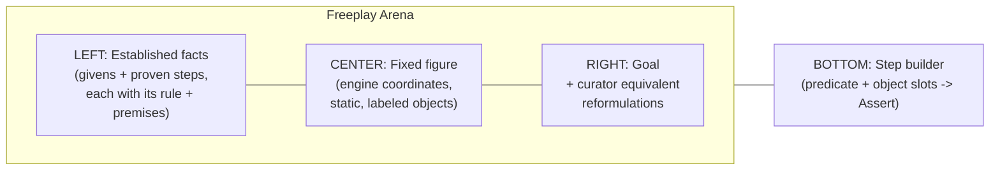
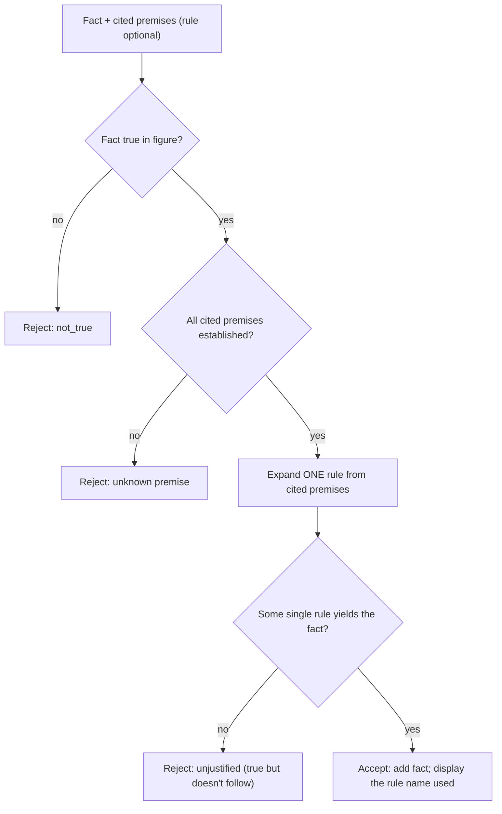
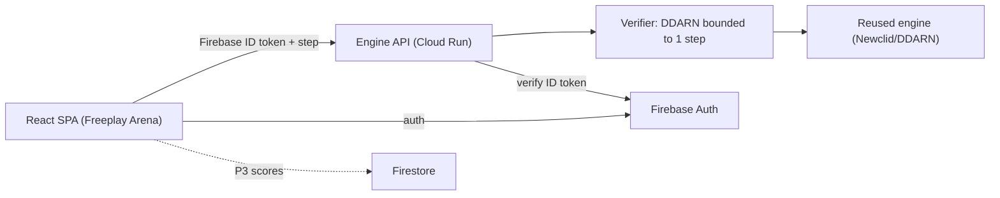
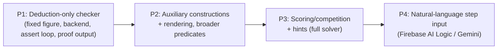

# PRD + Technical Design: Competitive Freeplay (Symbolic Geometry Proof Checker)

_Status: Draft for build. Companion to the app-wide [`PRD.md`](../PRD.md), [`docs/PROJECT_STATUS.md`](./PROJECT_STATUS.md), and [`docs/ROADMAP.md`](./ROADMAP.md)._

---

## 1. Overview

Competitive Freeplay is a new mode for the Interactive Olympiad Geometry app: a **Lean/Rocq-style interactive proof checker for Euclidean geometry**. The learner is given a fixed geometric construction and a goal (for example, "these three lines are concurrent" or "these four points are concyclic"). They build a proof by **asserting the next fact together with the established facts it relies on** — "x is y _because we have z_." The learner does **not** need to name the theorem; a symbolic engine confirms the fact is true **and** that a single rule derives it from the cited facts, then **displays the rule's name** for completeness and records the justified step. Crucially, **a statement that is merely true but with no cited basis does not advance the proof.** The learner wins when an asserted-and-verified fact matches the goal.

This is fundamentally different from the existing course mode, where a problem has one pre-authored answer graded by multiple-choice, math.js symbolic equivalence, or a board-state predicate (see [`src/lib/content/types.ts`](../src/lib/content/types.ts) and [`src/components/solvables/ProblemPlayer.tsx`](../src/components/solvables/ProblemPlayer.tsx)). Freeplay has **no single answer**: it grades a _path of reasoning_, step by step, the way a proof assistant does.

### Vision

"Lean for olympiad geometry." Replace the gap between _having intuition_ (the existing course builds this) and _writing a rigorous proof_ (which the app cannot currently teach) with a guided, machine-checked proving surface. Every step the learner makes is either accepted with an explicit justification or rejected with a nudge, so the learner internalizes the deductive structure of a proof — not just the final result.

### How it relates to AlphaGeometry

The 2024 AlphaGeometry system (DeepMind, Nature 2024) pairs a language model with a symbolic engine called **DDAR** (Deductive Database + Algebraic Reasoning). DDAR computes the _deductive closure_ of a set of geometric facts: it repeatedly applies named theorem rules (DD) and solves linear systems over directed angles, lengths, and ratios (AR) until the goal appears or no new facts can be derived. The language model's job is to propose the creative **auxiliary constructions** that DDAR cannot invent on its own.

We **reuse that symbolic engine** (its open-source successors — see [Section 6](#6-engine-design-the-proof-checker)) but **invert the roles**: instead of the engine solving the problem, the _human_ supplies the reasoning and the engine acts as a **checker**. This is the key product insight — DDAR is a solver, and we deliberately bound it down to a per-step verifier so the human does the thinking.

### Goals

- Teach rigorous geometric proof through an interactive, machine-checked, step-by-step surface.
- Reuse a battle-tested open-source symbolic engine rather than reimplementing geometric reasoning.
- Make each accepted step explainable: show the learner the named theorem and premises behind it.
- Author puzzles as data, consistent with the existing data-driven content model.
- Ship a usable first milestone quickly by deferring the hardest pieces (auxiliary constructions, dynamic rendering, scoring) to later phases.

### Non-Goals (v1)

- Auxiliary constructions (adding new points/lines/circles mid-proof). _Deferred to P2._
- Dynamic / draggable figures. v1 renders a **fixed** figure (the canonical realization). _Movable figures are now scoped on the construction model the verifier already uses — see [`design/MOVABLE_FIGURES.md`](./design/MOVABLE_FIGURES.md)._ Note: while the *rendered* figure is fixed, **verification is multi-case** — each step is checked against several independent realizations sampled from each puzzle's `construct(rng)` (see §13.1 and [`DDAR_ENGINE.md`](./DDAR_ENGINE.md) §6).
- Scoring, leaderboards, head-to-head competition. _Deferred to P3._
- A hint system. _Deferred to P3 (powered by running the full solver)._
- Natural-language step entry. _Originally deferred to P4 — has **since shipped** (off by default; the translator only proposes a step the same `verify()` checks). See §13.1._
- Replacing or modifying the existing course mode.

> Naming note: the feature is called "Competitive Freeplay," but the competitive/scoring layer is explicitly a later phase (P3). v1 is single-player, untimed, practice-oriented proving.

---

## 2. Personas & User Stories

**Gabriel — 18, Colombia.** The existing app's persona: a motivated self-learner who has built intuition through the angle-chasing course and now wants to learn to _prove_ olympiad results, not just recognize them.

**Mariana — 16, contest trainee.** Preparing for national olympiad; already knows the classic theorems by name; wants a sandbox to drill writing tight, fully justified proofs and to discover that her "obvious" steps are or aren't single-rule consequences.

### User stories (v1)

- As Gabriel, I can open a freeplay puzzle and see the **given facts**, the **figure**, and the **goal**, so I understand what I must prove.
- As Gabriel, I **assert a step as a fact _plus the facts it relies on_** — the new fact (a predicate over objects) **and** the established facts that justify it ("x is y because we have z") — so my reasoning, not just my conclusion, is what gets checked. I do **not** have to name the theorem.
- As Gabriel, when I submit a step, the system tells me **(a) whether the asserted fact is true** and **(b) whether a single rule actually derives it from the facts I cited**, so I learn whether my reasoning is sound.
- As Gabriel, when my step is accepted, the system **shows me the name of the theorem** it used (for completeness/learning), even though I didn't have to name it myself.
- As Gabriel, **a statement that is merely true but with no valid cited basis does not advance the proof** — I cannot progress by guessing true facts; I must say what it follows from.
- As Gabriel, when my step is rejected, the feedback distinguishes **"not true," "true but doesn't follow from the facts you cited,"** and **"true but more than one step away,"** so I know how to fix it.
- As Gabriel, when I assert a justified step whose fact **matches the goal**, the puzzle is **solved** and I can read the **assembled, human-readable proof** of my whole path (each line a fact with its premises and the engine-supplied rule name).
- As Mariana, I can attempt a puzzle in **different ways** (different intermediate facts and supporting facts) and still have each valid, justified path accepted, because the checker validates reasoning rather than matching one answer.

### User stories (later phases, documented for context)

- _(P2)_ As Mariana, I can **add an auxiliary construction** (drop a perpendicular, take a midpoint) when the given figure is insufficient.
- _(P3)_ As Gabriel, I can see my **time and step count** and compare against my **personal best** / a leaderboard.
- _(P3)_ As Gabriel, when stuck, I can request a **hint** for a reasonable next step.
- _(P4)_ As Gabriel, I can **type a step in natural language** and confirm the structured statement the system proposes.

---

## 3. Confirmed Design Decisions

These were settled during planning and are load-bearing for everything below.

| Decision | Choice | Rationale |
|---|---|---|
| Engine role | **Proof checker** (never auto-solves) | Faithful to the Lean/Rocq vision; the human supplies the reasoning. |
| Step model | Student asserts a fact **together with the established facts it relies on** ("x is y because we have z"); the engine verifies the fact is true and that **a single rule derives it from the cited facts**, then **displays that rule's name**. Naming the theorem is **not** required of the student. | Lowers the burden (no need to memorize theorem names) while still requiring the student to articulate _what it follows from_; the engine supplies the rule name for learning. |
| Anti-cheese | A merely-true statement **with no valid cited basis does not advance**; verification is also **bounded to one inference step** | Two guards: (1) you cannot progress by guessing true facts — an assertion whose cited facts don't yield it in one rule is rejected; (2) since the goal is always in the _full_ closure, one-step bounding stops asserting the goal directly and forces a genuine chain. |
| Engine sourcing | **Reuse** the open-source Python engine (Newclid/DDARN, or AlphaGeometry2 DDAR2; both Apache-2.0) | Reimplementing DD+AR is research-grade effort; reuse is the pragmatic path to real rigor. |
| Architecture | Engine runs on a **backend** (Cloud Run), Firebase-ID-token authenticated | The engine is Python; the app is otherwise a serverless SPA. This is the project's first server. |
| Formal language | Adopt the **AlphaGeometry/JGEX DSL** directly | Compatibility with the reused engine and its rule set; no translation drift. |
| v1 figure | **Fixed**, engine-realized coordinates, non-draggable | Reconciles "full auxiliary constructions" (P2) with "defer rendering": prove out the backend + checking loop first. |
| Deferred | Aux constructions (P2), dynamic rendering (P2), scoring/competition (P3), hints (P3), NL input (P4) | De-risk and ship value early. |

---

## 4. UX / UI Specification (v1)

### 4.1 Layout

A focused three-panel proving surface at `/freeplay/:puzzleId`:



- **Left — Established facts.** An ordered list. The given premises seed the list; each accepted step appends a new fact annotated with the **facts it relied on** (the learner-cited premises, rendered as references back to earlier rows) and the **rule name the engine supplied**. Premises are also selected from this panel when building a step. KaTeX for predicate display (reuse [`MathText`](../src/components/MathText.tsx)).
- **Center — Fixed figure.** The construction realized at engine-provided coordinates and rendered statically via the existing [`GeometryBoard`](../src/components/geometry/GeometryBoard.tsx). Points are labeled and **selectable** (for the step builder) but **not draggable** in v1. Accepted facts may briefly highlight the relevant objects using the existing overlay mechanism (`applyOverlay` / `clearOverlays` on the board handle).
- **Right — Goal.** The statement to prove, plus optional **curator-authored equivalent reformulations** ("it suffices to show ..."). In v1 these are informational guidance, not separate interactive backward goals.

### 4.2 The assert loop (core interaction)

```mermaid
sequenceDiagram
  participant U as Learner
  participant C as Client (StepBuilder)
  participant B as Backend (/verify-step)
  participant E as Engine (DDARN, single-step)

  U->>C: Pick predicate + objects (the fact) AND select the facts it relies on (premises)
  C->>C: Build candidate fact + cited premises (DSL)
  C->>B: POST /verify-step { establishedFacts, candidateFact, justification }
  B->>E: Seed cited premises; try a single rule that derives the fact
  E-->>B: true? derivable-in-one-rule? + which rule + traceback
  alt Fact true AND a single rule derives it from cited facts
    B-->>C: { valid: true, rule, premises, humanReadable }
    C->>U: Append fact to LEFT; DISPLAY the rule name; highlight objects
    C->>C: Goal match? -> if yes, Win + show full proof
  else Not true
    B-->>C: { valid: false, reason: "not_true" }
    C->>U: "That statement isn't true in this figure"
  else True but not derivable from the cited facts in one step
    B-->>C: { valid: false, reason: "unjustified" }
    C->>U: "True, but it doesn't follow from the facts you cited"
  end
```

- **Assert = fact + the facts it relies on.** A step is only complete when the learner provides **both** the fact **and** at least the established facts that justify it. The Assert button stays disabled until the fact is built and supporting facts are cited — a bare fact with no cited basis cannot be submitted.
- **Predicate selection (the fact).** The learner picks from the supported predicate palette (Section 5). The UI shows the predicate's slots (e.g. `eqangle` takes two angles → eight points, or two angle objects depending on the chosen UI abstraction).
- **Object selection.** Slots are filled by clicking labeled objects on the fixed figure or selecting from an object list. The client assembles a DSL `Predicate`.
- **Citing the basis ("because we have z").** The learner selects the **established facts** the step relies on from the left panel. Naming the theorem is **optional** — the engine finds the single rule that derives the fact from those cited facts. This citation is what gets verified; it is required.
- **Feedback (three outcomes).** Accept → the fact joins the established list, and the system **displays the rule name the engine used** alongside the learner's cited premises. Reject splits into **not true** (false in the figure) vs **unjustified** (true, but no single rule derives it from the cited facts, or it is more than one step away) — so the learner knows whether the problem is the claim or the reasoning. Importantly, a true-but-unjustified assertion is **not** added to the established facts.

### 4.3 Win & proof output

A puzzle is solved when an established (verified) fact matches the goal predicate or one of its authored equivalents (structural equality in the DSL, modulo predicate symmetry). On win, the client renders the **assembled human-readable proof**: the ordered chain of facts, each line showing the rule and premises, reconstructed from the engine's traceback. This is the learner's reward and a study artifact.

### 4.4 Empty/error states

- Backend unreachable or cold-starting: show a "warming up the prover" state with retry; never silently drop a step.
- Ambiguous selection (predicate slots not fully filled): disable Assert until valid.
- Guest mode (no Firebase): freeplay still works for solving; only later-phase persistence/scoring requires auth.

---

## 5. Formal Model (DSL & Content)

### 5.1 Adopt the AlphaGeometry / JGEX language

We adopt the engine's formal language directly so puzzles and steps map 1:1 onto what the engine understands. Two vocabularies:

- **Predicates** (facts/relations). Representative set:
  - `coll(A, B, C)` — collinear
  - `para(A, B, C, D)` — `AB ∥ CD`
  - `perp(A, B, C, D)` — `AB ⊥ CD`
  - `cong(A, B, C, D)` — `AB = CD` (segment congruence)
  - `eqangle(A, B, C, D, E, F, G, H)` — directed angle `∠(AB,CD) = ∠(EF,GH)`
  - `cyclic(A, B, C, D)` — concyclic
  - `simtri` / `contri` — similar / congruent triangles
  - `midp(M, A, B)` — `M` is the midpoint of `AB`
  - `eqratio(...)` — ratio equalities
- **Construction definitions** (`defs.txt` in the engine) — used to _build_ figures and, in P2, auxiliary objects: `midpoint`, `foot`, `on_line`, `on_circle`, `circle`, `intersection_ll`, `eqdistance`, `parallel_through`, `perpendicular_through`, etc.
- **Rules** (`rules.txt`) — the named DD theorems the engine applies. These supply the human-readable rule names surfaced to the learner.

The client mirrors these as TypeScript types in `src/lib/freeplay/dsl.ts`. Keeping the client types a thin reflection of the engine's vocabulary avoids translation drift (a confirmed decision).

```ts
// src/lib/freeplay/dsl.ts (illustrative)

/** A geometric object the learner can reference: usually a labeled point. */
export type PointId = string; // "A", "B", "H", ...

/** A predicate (fact) in the adopted AG/JGEX vocabulary. */
export type Predicate =
  | { name: "coll"; points: [PointId, PointId, PointId] }
  | { name: "para"; points: [PointId, PointId, PointId, PointId] }
  | { name: "perp"; points: [PointId, PointId, PointId, PointId] }
  | { name: "cong"; points: [PointId, PointId, PointId, PointId] }
  | { name: "cyclic"; points: [PointId, PointId, PointId, PointId] }
  | { name: "midp"; points: [PointId, PointId, PointId] }
  | {
      name: "eqangle";
      points: [PointId, PointId, PointId, PointId, PointId, PointId, PointId, PointId];
    }
  | { name: "simtri"; points: PointId[] }
  | { name: "eqratio"; points: PointId[] };

/** A construction definition (P1: building the fixed figure; P2: aux moves). */
export interface Construction {
  def: string; // e.g. "midpoint", "foot", "on_line"
  output: PointId; // the new object's label
  args: PointId[]; // existing objects it depends on
}

/** A rule id from the engine's rules.txt vocabulary. */
export type RuleId = string; // e.g. "inscribed_angle", "vertical_angles"

/**
 * What the learner must supply for a step: the established facts it relies on
 * (the "because we have z"). `premises` is REQUIRED - a fact with no cited
 * basis cannot advance. `rule` is OPTIONAL: the learner may name the theorem,
 * but normally leaves it blank and the engine fills in the rule it used.
 */
export interface Justification {
  premises: Predicate[]; // established facts it relies on (subset of current facts)
  rule?: RuleId; // optional: learner-named theorem (usually omitted)
}

/** A complete asserted step: a new fact plus the facts it relies on. */
export interface Step {
  fact: Predicate;
  justification: Justification; // premises required; rule optional
  resolvedRule?: RuleId; // engine-supplied rule name, shown for completeness
}
```

### 5.2 The `Puzzle` content object

Puzzles are curated and authored as data, mirroring the existing content pattern (lessons assembled in [`src/lib/content/course.ts`](../src/lib/content/course.ts) from files in [`src/lib/content/lessons/`](../src/lib/content/lessons/)). Freeplay puzzles live in `src/lib/freeplay/puzzles/` with a registry analogous to `course.ts`.

```ts
// src/lib/freeplay/types.ts (illustrative)
import type { Predicate, Construction, PointId } from "./dsl";

export interface Puzzle {
  id: string;
  title: string;
  difficulty: "intro" | "core" | "challenge";

  /** Ordered constructions that BUILD the fixed figure (v1: authored, fixed). */
  construction: Construction[];

  /** Initial known facts (the hypotheses) the learner starts with. */
  given: Predicate[];

  /** The statement to prove. */
  goal: Predicate;

  /** Curator-authored "it suffices to show" reformulations (right panel). */
  equivalentGoals?: Predicate[];

  /**
   * Pre-realized coordinates for static rendering in v1 (engine-produced,
   * cached at authoring time). Avoids a /realize round-trip on load.
   */
  coords: Record<PointId, [number, number]>;

  /** Optional: a curated reference proof (used for P3 hints & scoring baselines). */
  referenceProof?: { fact: Predicate; rule: string; premises: Predicate[] }[];
}
```

### 5.3 UI object ↔ DSL mapping

- Labeled points on the figure are the atomic referents; the learner clicks them to fill predicate slots.
- For predicates that conceptually operate on higher-level objects (an "angle," a "line"), the UI presents the higher-level abstraction but lowers it to the point-tuple the DSL expects (e.g. selecting angle `∠ABC` fills three points; selecting two lines for `para` fills four).
- Rendering uses `coords` to place points via the existing board spec types in [`src/lib/geometry/board-types.ts`](../src/lib/geometry/board-types.ts); segments/circles implied by the construction are drawn as static elements through the helpers in [`src/lib/content/boards.ts`](../src/lib/content/boards.ts).

---

## 6. Engine Design (the proof checker)

### 6.1 Reuse, don't reinvent

We reuse an open-source DDAR-family engine. Two candidates, both Apache-2.0:

- **Newclid / DDARN** (arXiv 2411.11938) — a refactor of AlphaGeometry's DDAR explicitly aimed at being "user-friendly" and **extensible**, with a CLI and **agent-steerable reasoning** and GeoGebra input. _Recommended_, precisely because steering/bounding the reasoning is exactly what a single-step checker needs.
- **AlphaGeometry2 DDAR2** (DeepMind, Jan 2026) — faster and broader scope, but tuned for solving throughput rather than external step control.

Decision leaning: **DDARN** for v1 (extensibility + agent control), revisit DDAR2 if coverage/perf demands it. This is an open question to close during the spike (Section 11).

### 6.2 How DDAR works (and why bounding matters)

DDAR computes the **deductive closure**: starting from premises, it iterates
1. **DD** — apply named theorem rules from `rules.txt` (each a predicate-hypotheses ⇒ predicate-conclusion implication), plus built-in "intrinsic" rules, and
2. **AR** — algebraic reasoning: maintain linear equations over directed angles, lengths (logs), and ratios, and solve them (Gaussian elimination) to surface new equalities,

until the goal is present or nothing new can be added. Every derived fact has a **dependency traceback** to the premises and rule that produced it.

**The trap this creates for a checker:** for any _true_ theorem, the goal is in the full closure of the givens. So "is `candidateFact` entailed by the established facts?" is trivially _yes_ for the goal at step one. An unbounded checker would let the learner assert the goal immediately and "win." Therefore the checker must be **bounded to a single inference step**.

### 6.3 Single-step checking of a learner-supplied basis

The learner submits a **fact + the established facts it relies on** (cited premises; an optional learner-named rule). The backend verifies:

1. **Truth check.** Confirm the asserted fact actually holds in the figure (the engine numerically realizes the construction and checks the predicate). If false → reject with reason `not_true`.
2. **Premise check.** Confirm every cited premise is an **established fact** (a given or a previously accepted step).
3. **Derivability check (one step).** Seed a fresh engine state with the **cited premises** and expand a **single** inference (one DD rule-application, or one AR resolution over the cited equations). If some single rule produces the asserted fact → accept; otherwise → reject with reason `unjustified` (it is true but is not derivable from the cited facts in one step, or it needs an intermediate step). If the learner _did_ name a rule, additionally check that rule matches; otherwise the engine just takes whichever single rule works.
4. On accept, read the **traceback** to get the **rule name to display** (and confirm the premises actually used), and (on goal match) assemble the human-readable proof.



Why this is non-cheeseable and still genuinely a proof game:
- **Truth alone is not enough.** A statement that is merely true but not derivable in one step from the learner's cited facts is rejected — the learner cannot advance by guessing true facts (the explicit requirement driving this design). They must say _what it follows from_.
- You cannot assert the goal directly unless it is _literally_ one rule from established facts.
- Each accepted fact becomes a premise for the next, so the learner builds a real, justified forward chain from givens to goal.
- Acceptance is an _actual_ rule application found by the engine, so the displayed reason is sound (not a numeric coincidence) — and the learner gets the theorem's name without having to know it.

### 6.4 The central technical bet

Repurposing a closure-computing **solver** into a one-step **checker** is the core risk. It requires that the engine let us (a) bound the number of inference levels and (b) constrain **AR** so it does not bundle many inferences into a single "step" (AR naturally returns _all_ linear consequences at once). Newclid's advertised agent-steering and modular reasoning are the hook; this must be validated in a spike before committing (Section 11). The learner-cited premises help here:
- Because the learner **cites the specific premises** the step relies on, the checker expands rules from _that_ premise subset only, which naturally sharpens "one step" (AR is constrained to the cited equations rather than the full set).
- Treat "one step" as "one DD rule application **or** one AR resolution over the cited premises," tuned empirically.
- The learner does **not** name the rule, so the checker accepts whichever single rule over the cited premises yields the fact and then displays its canonical name — no need to match a learner-named theorem.

### 6.5 Engine as solver — reserved for later

The full solver is **not** used in v1, but it is the natural basis for the **P3 hint system**: run DDAR to completion to find a valid next fact and surface it (or its rule) as a hint. Keeping the same engine for checking and hinting is a deliberate synergy.

---

## 7. Architecture

### 7.1 The change

Today the app is a pure client-side SPA: React + Vite, Firebase Auth + Cloud Firestore, no custom server (see [`docs/PROJECT_STATUS.md`](./PROJECT_STATUS.md) §3 and [`src/lib/firebase/config.ts`](../src/lib/firebase/config.ts)). Freeplay introduces the project's **first backend**: a Python service hosting the engine.



### 7.2 Hosting

- **Recommended: Cloud Run** container. The engine needs `numpy` / `scipy` / `sympy` and a non-trivial Python runtime; a container gives full control and avoids Cloud Functions packaging limits. Pairs naturally with the existing Firebase/GCP footprint and Firebase Hosting rewrites.
- Alternative considered: Cloud Functions (2nd gen, Python). Rejected for v1 due to heavy deps and cold-start/runtime constraints, but revisit if ops simplicity matters more than control.

### 7.3 API contract (stateless)

The client holds the proof state and sends it with each request; the backend is stateless (simpler scaling, no session store).

```http
POST /verify-step
Authorization: Bearer <Firebase ID token>
{
  "problemId": "orthocenter-concurrence",
  "establishedFacts": [ /* Predicate[] : givens + accepted steps */ ],
  "candidateFact": { "name": "eqangle", "points": ["B","A","D","B","E","D"] },
  "justification": {
    "premises": [ /* Predicate[] the learner cited, subset of establishedFacts - REQUIRED */ ],
    "rule": "inscribed_angle"                  // OPTIONAL learner-named rule; usually omitted
  }
}
-> 200  (accepted)
{
  "valid": true,
  "rule": "inscribed angle (same arc)",        // engine-supplied canonical name, shown to the learner
  "premises": [ /* Predicate[] actually used */ ],
  "humanReadable": "Since A,B,D,E are concyclic, angles BAD and BED subtend arc BD, so they are equal."
}
-> 200  (rejected; nothing added)
{
  "valid": false,
  "reason": "not_true" | "unknown_premise" | "unjustified"
  // unjustified = true in the figure but no single rule derives it from the
  // cited premises (or it is more than one step away)
}
```

The required `justification.premises` is what enforces the rule that a merely-true statement cannot advance: a request that cites no facts (or facts from which no single rule yields the claim) is rejected by contract. `justification.rule` is optional — if omitted, the engine reports the rule it used; if provided, the engine additionally checks it matches.

```http
POST /realize          # authoring-time / P2 dynamic figures
{ "construction": [ /* Construction[] */ ] }
-> 200
{ "coords": { "A": [0,3], "B": [-3.4,-2], "C": [3.4,-2.2], ... } }
```

- **Auth:** verify the Firebase ID token server-side (Firebase Admin SDK) before doing work; reject anonymous calls in authenticated deployments (guest mode can call a rate-limited public path or be disabled for freeplay, TBD in P1).
- **Win check:** the same `/verify-step` call; the client compares the accepted fact to the goal/equivalents. (The backend may also return a `goalReached` flag as a convenience.)

### 7.4 Operational concerns

- **Cold starts + engine init are slow.** Keep a minimum warm instance; lazy-load the engine once per instance and reuse across requests.
- **Latency budget.** A single-step expansion should be fast (well under the full-closure cost), but bound per-request CPU/time and return a graceful timeout.
- **Caching.** Cache realized figures by construction hash; cache repeated identical `/verify-step` calls within a session.
- **Cost.** One always-on small instance plus per-request CPU; acceptable for a single-course app, but note this is new recurring spend the serverless app did not have.
- **Security.** Token verification, request size limits, and CPU/time caps guard against abuse of an unbounded-looking compute endpoint.

---

## 8. Mapping onto the Existing Codebase

### 8.1 Reused as-is

- [`GeometryBoard`](../src/components/geometry/GeometryBoard.tsx) / [`useJSXGraph`](../src/lib/geometry/useJSXGraph.ts) / [`board-types.ts`](../src/lib/geometry/board-types.ts) — render the fixed figure from engine `coords` (non-draggable points), and highlight objects on accepted steps via the existing `applyOverlay` / `clearOverlays` handle.
- [`boards.ts`](../src/lib/content/boards.ts) helpers — draw segments/circles/labels statically.
- [`MathText`](../src/components/MathText.tsx) — render predicates and the human-readable proof (KaTeX).
- [`AuthContext`](../src/lib/auth/AuthContext.tsx) — obtain the Firebase ID token for backend calls.
- [`ProtectedRoute`](../src/components/ProtectedRoute.tsx) / [`Layout`](../src/components/Layout.tsx) — gate and frame the new routes.
- Firestore helpers in [`progressService.ts`](../src/lib/firebase/progressService.ts) — extended in P3 for scores.

### 8.2 New client modules — `src/lib/freeplay/`

| File | Responsibility |
|---|---|
| `dsl.ts` | `Predicate`, `Construction`, `PointId` types mirroring the AG/JGEX vocabulary. |
| `types.ts` | `Puzzle` content object (Section 5.2). |
| `api.ts` | `verifyStep()` / `realize()` calls; attaches the Firebase ID token; error/timeout handling. |
| `proof.ts` | Client proof state + reducer (append justified `Step`, dedupe, goal match), human-readable proof assembly. |
| `puzzles/` | Curated `Puzzle` data + a registry (`freeplayPuzzles`), analogous to [`course.ts`](../src/lib/content/course.ts). |

### 8.3 New UI

- Routes in [`src/App.tsx`](../src/App.tsx): `/freeplay` (puzzle list) and `/freeplay/:puzzleId` (arena), inside the existing `ProtectedRoute` → `Layout` block.
- `src/pages/FreeplayList.tsx` — puzzle catalog with difficulty.
- `src/pages/FreeplayArena.tsx` — the three-panel proving surface; owns proof state.
- `src/components/freeplay/`:
  - `FactList.tsx` (left) — established facts with rule/premise annotations; also the surface for selecting premises when justifying a step.
  - `FixedFigure.tsx` (center) — wraps `GeometryBoard`, adds object selection for the builder.
  - `GoalPanel.tsx` (right) — goal + equivalent reformulations.
  - `StepBuilder.tsx` (bottom) — builds a full `Step`: predicate palette + object-slot filling (the fact) **and** premise selection from the fact list (the "because we have z"). Assert is disabled until the fact is built and at least one supporting fact is cited. Naming a rule is optional; the engine returns the rule name to display.
  - `ProofSummary.tsx` — the win-state human-readable proof.

### 8.4 New backend — `engine/` (separate service)

- Vendored/pinned Newclid (or DDAR2) + a thin HTTP API (FastAPI/Flask).
- A `verifier` module that seeds facts and runs the bounded single-step expansion + traceback extraction.
- Firebase Admin token verification.
- `Dockerfile` + Cloud Run deploy config. Kept out of the Vite bundle; documented in README.

### 8.5 Content authoring

Curated puzzles authored in the AG/JGEX DSL with pre-realized `coords` (produced once via `/realize` at authoring time) and curator-authored `equivalentGoals`. Human-curated initial set, consistent with the existing "content shipped in the bundle" model.

---

## 9. Data Model

- **Content (v1):** puzzles shipped in the JS bundle as typed TS (`src/lib/freeplay/puzzles/`), exactly like course content today. No Firestore dependency to _play_.
- **Scores (P3):** `users/{uid}/freeplay/{puzzleId}` → `{ solved: bool, bestTimeMs, bestSteps, lastProof, updatedAt }`, written through extended [`progressService.ts`](../src/lib/firebase/progressService.ts), guarded by the existing per-user Firestore rules pattern (`request.auth.uid == userId`).
- **No proof state in Firestore for v1:** the client holds the in-progress proof; only final outcomes (P3) persist.

---

## 10. Phased Roadmap



- **P1 — Engine integration MVP.** Fixed figure, deduction-only checker. 3–5 curated puzzles. Backend on Cloud Run with `/verify-step`. The assert loop, rule-named feedback, win detection, and human-readable proof output. _Validates the central bet: bounding DDARN to a clean single step._
- **P2 — Auxiliary constructions + rendering.** Learner adds DSL constructions (`midpoint`, `foot`, `on_line`, `circle`, ...); engine-positioned static rendering of new objects; broader predicate/goal coverage. Possibly partial dynamic rendering.
- **P3 — Competition + hints.** Time/step scoring, personal bests, async leaderboards (Firestore). Hint system powered by running the **full** solver to find a valid next step.
- **P4 — Natural-language input.** Optional NL entry translated to a structured assertion the learner confirms before checking. _As built (ahead of schedule), the provider is **OpenAI** via a Firebase Cloud Function (`functions/translateStep`), not Gemini/Firebase AI Logic — see §13.1 and [`design/NL_TO_DDAR_V2_OPENAI.md`](./design/NL_TO_DDAR_V2_OPENAI.md); gated/optional like guest mode._

### Success criteria (v1 / P1)

- A learner can solve at least 3 curated puzzles end-to-end by asserting **justified steps** (fact + cited supporting facts), with each accepted step recording the cited premises and the engine-supplied rule name. The learner never has to name a theorem.
- A **true-but-unjustified** assertion (cites no facts, or facts from which no single rule yields the claim) is **rejected** and does **not** advance the proof — the core requirement that you cannot win by stating true facts alone.
- Rejections correctly distinguish **not true** vs **true-but-unjustified** vs **more than one step away**.
- Asserting the goal directly (without the intermediate chain) is **rejected** unless it genuinely is one justified step away — demonstrating the bounding works.
- On solving, a correct, readable proof of the learner's path is displayed.
- Adding a new puzzle requires only authoring a `Puzzle` data object (no engine or UI changes).
- The backend verifies Firebase ID tokens and stays within its latency/CPU budget under normal use.

---

## 11. Risks & Mitigations

| Risk | Impact | Mitigation |
|---|---|---|
| **Single-step bounding** of a closure-solver is the central bet; AR may over-bundle inferences into one "step" | High — defines whether the game is rigorous and fun | **Spike first**: validate that Newclid/DDARN level/agent controls allow a clean one-step expansion; tune "one step" = one DD rule **or** one AR resolution over a minimal/cited equation set; optionally require premise selection to constrain AR. |
| Engine **init / cold-start latency** | Medium — sluggish first step | Min warm instance on Cloud Run; load engine once per instance; cache realized figures. |
| **DSL ↔ UI mapping** complexity (point-tuples for angles/lines) | Medium — confusing slot UX | Present higher-level objects (angle/line) and lower to point-tuples internally; constrain selection to valid objects. |
| **Server cost & ops** added to a serverless app | Medium — new recurring spend + maintenance | Single small Cloud Run service; document deploy; revisit Cloud Functions if ops burden is high. |
| **Scope / magnitude** — effectively rebuilding the symbolic half of AlphaGeometry plus a novel proving UI | High — long path to "done" | Strict phasing; P1 ships a usable, narrow slice; reuse (not reimplement) the engine. |
| v1 **fixed figure** is less engaging than the app's draggable boards | Low/Medium — UX regression vs course mode | Frame v1 as a proving sandbox; restore interactivity with rendering in P2. |
| **Engine coverage** (DDARN can't validate some intended steps) | Medium — puzzles feel arbitrary | Curate puzzles within the engine's known rule set; expand `rules.txt`/predicates as needed (Newclid is designed to be extended). |
| **Guest mode** vs authenticated backend | Low | Decide in P1: rate-limited public verify path or require sign-in for freeplay. |

---

## 12. Open Questions

- **Engine choice:** DDARN vs DDAR2 for v1 (leaning DDARN for steerability). Close during the spike.
- **Predicate/goal catalog for v1:** which subset of predicates and which goal types (start with `eqangle`, `cyclic`, `coll`, `para`, `perp`, `cong`; add `simtri`/`eqratio` as coverage allows).
- **"One step" definition:** exact bounding of DD vs AR; the learner-cited premises sharpen AR, but the precise per-step bound needs tuning in the spike.
- **Justification strictness (resolved):** the learner cites the **facts** a step relies on ("because we have z") but does **not** name the theorem; the engine accepts any single rule over the cited facts and **displays its canonical name**. Optionally the learner may name a rule, in which case the engine also checks it matches.
- **Premise-citing UX:** how much premise selection to require — every premise explicitly, or allow the engine to confirm a minimal sufficient subset from a looser selection — without weakening the "no unjustified advance" guarantee. (E.g. may the learner cite a superset and let the engine find the needed subset?)
- **Equivalent goals UX:** purely informational (v1) vs interactive backward subgoals (possible future).
- **Guest access** to the backend: public-but-rate-limited vs sign-in-required.
- **Hosting:** Cloud Run (recommended) vs Cloud Functions 2nd gen — finalize alongside cost/ops review.

---

## 13. Implementation Status (As-Built)

> This section records what is **actually built** as of this writing, and it has
> grown well beyond the original P1 prototype. The implementation **diverges
> deliberately** from Sections 6–7: instead of a Python DDARN backend on Cloud Run,
> it ships a **hand-written TypeScript rule engine that runs entirely in the
> browser**, now with a **length/ratio (`eqratio`) reasoning layer**, **31 deduction
> rules**, **14 curated puzzles** (incl. IMO 2019 P2 end-to-end), **natural-language
> step input**, and a **per-user proof archive**. The remote `/verify-step` contract
> still exists as a fallback path, but **no backend is deployed**, so all step
> checking is local — `api.ts` calls the local `verify()` unless
> `VITE_FREEPLAY_API_URL` is set. (The one deployed Cloud Function is `translateStep`
> for natural-language input, which only *proposes* a structured step the local
> `verify()` then judges — see §13.1.) For the full engine internals see
> [`DDAR_ENGINE.md`](./DDAR_ENGINE.md).

### 13.1 What works

- **Forward, single-step, rule-based, multi-case checker** (`verify.ts` + `realize.ts`): a step is accepted iff (1) the asserted fact is numerically true **in several independent generic realizations** of the figure **and** (2) some rule in the library derives it in one step from exactly the cited facts **in every one of them**. Realizations come from each puzzle's `construct(rng)` (free points sampled, dependents derived so the givens always hold). Reasons returned: `not_true` (false in some realization), `unknown_premise`, `unjustified` (derivation fires only in some), `extraneous_premises` (a premise droppable in all). This both matches the PRD's anti-cheese intent (true-but-uncited does not advance) and closes the "true in one diagram by accident" gap.
- **Extended DSL with angle arithmetic** (`dsl.ts`, `form.ts`, `rational.ts`): facts are a discriminated union `Fact = Rel | Aval`. `Rel` covers `coll, para, perp, cong, cyclic, midp, eqangle`. `Aval` is an **angle-value** fact `∠XYZ = Form`, where `Form` is a linear expression with **exact rational** coefficients over named variables **and/or angle tokens**, with a parser (`parseForm("180 - A/2 - B/2")`, `parseForm("180 - angle(A,O,C)")`) and KaTeX renderer (`fstr`). Angle tokens (`angle(A,B,C)`, vertex B) let a learner do arithmetic **between angles**, not just over the puzzle's global variables.
- **Rule library** (**31 rules**): 13 hand-written `CORE_RULES` in `rules.ts`
  (`inscribed_angle`, `collinear_same_ray`, `angle_value_transfer`,
  `angle_value_equal`, `angle_addition`, `triangle_angle_sum`, `straight_supplement`,
  `isosceles`, `midsegment`, **`para_equal_angles`**, **`converse_inscribed`**,
  **`concyclic_merge`**, **`pappus`**), 13 `PROMOTED_RULES` promoted from the research
  lab (`rules/`: `midpoint_congruence`, `cong_transitivity`, `perp_bisector`,
  `isosceles_converse`, `sas_congruence`, `sas_shared_vertex`, `sss_congruence`,
  `shared_side_congruence`, `concyclic_equal_radii`, `pascal`,
  `coincident_direction_collinear`, `concyclic_from_directed_angles`,
  `thales_diameter`), and 5 length/ratio `RATIO_RULES` (`lengths/rules/`:
  `similar_triangles_aa`, `thales_basic_proportionality`, `sas_similarity`,
  `power_of_a_point`, `tangent_secant_power`). The verifier runs
  `ALL_RULES = [...RULES, ...RATIO_RULES]`. Each is **geometrically guarded** by
  coordinate checks (`geom.ts`: collinearity, betweenness, same-ray, same-side, line
  intersection) so a rule only fires when the configuration licenses it. `pappus`
  takes two cited `coll` lines, tries every correspondence, matches the three
  cross-intersection points to named points via coordinates, and emits a `coll` (or,
  when one cross-pair is parallel — the point at infinity — a `para`), which is
  exactly the projective step in IMO 2019 P2.
  - `para_equal_angles` (lesson 2): from a cited `para(A,B,C,D)` it scans all named points on each parallel line, treats every connector as a transversal, and emits the (numerically-verified) alternate/corresponding `eqangle` facts. This produces *explicit* `eqangle` facts that downstream DD rules and the learner can cite — AR collapses parallel directions internally, but only DD emits citable facts.
  - `converse_inscribed`: emits `cyclic(P,Q,X,Y)` from two angles subtending the **same segment** `PQ`, in either of two forms: (a) a cited `eqangle(P,X,Q, P,Y,Q)` with apexes on the **same side** (equal angles), or (b) a cited `aval` angle-arithmetic relation `∠PXQ = c − ∠PYQ` with apexes on **opposite sides** (supplementary — the cyclic-quadrilateral criterion). Reim's theorem is just two such applications, so no separate Reim rule is needed.
  - `concyclic_merge` (same circle): from two cited `cyclic` facts that share **3 non-collinear points**, every 4-subset of their union is concyclic — three points pin a unique circle. This is the "all five points are on circle `A2B2C`" step: `cyclic(A2,B2,C,Q1)` + `cyclic(A2,B2,C,P1)` ⇒ `cyclic(A2,B2,Q1,P1)` with no angle chase.

- **By-symmetry / analogous arguments** (`symmetry.ts`): a learner can re-use a finished sub-proof "with the letters switched". They pick a proven fact `F` and a point relabeling σ (disjoint swaps, e.g. `A-B, P-Q, A1-B1, P1-Q1, A2-B2`); the engine accepts `σ(F)` iff σ is an **automorphism of the puzzle's givens** (`σ(givens) = givens`, up to each relation's symmetries). This is sound because every rule is relabeling-invariant, so σ applied to `F`'s derivation is itself a valid derivation of `σ(F)` in the same figure; a numeric truth check guards as a backstop. Justification is reported as "by symmetry (analogous argument)". The UI exposes this via a **Derive / By-symmetry** toggle in the step builder. This is exactly the IMO 2019 P2 move "…and analogously `CP1B2A2` is cyclic".
- **Algebraic Reasoning (AR) layer** (`ar.ts`): a TypeScript port of AlphaGeometry DDAR's `ar.py` — a Gaussian-elimination table over exact rationals. `verify()` accepts a step if either a DD rule matches **or** the fact is a **linear consequence** (angle chase) of the cited facts plus their one-step DD consequences. This makes the checker **complete for linear angle reasoning** *relative to the cited facts*. AR is **cite-driven**: every line gets its OWN direction variable (keyed by its unordered point-pair), and two lines are linked only when a **cited** fact justifies it — `para`/`coll` merge directions, `perp` offsets by 90°, `eqangle`/`aval` relate angle differences. Coordinates fix only the signs/branches (the ε and whole-turn `j`), never collapse variables, so the checker can't read parallelism or collinearity "for free" off the diagram. DD rules still **inject** non-linear geometric facts (e.g. `cyclic ⇒ inscribed angle`) that AR then closes over. Accepted AR steps display as "algebraic angle-chase". _The length/ratio dual has since shipped: `LengthAR` (`lengths/lengthAR.ts`) is a log-distance Gaussian table over `cong`/`eqratio`/`midp`; accepted length steps display as "algebraic length-chase" (see §13.1 ratio note below)._

- **Variadic collinearity (a whole line in one fact).** `coll` now accepts **3 or more** points, so a line is stated once — `coll(Q,A1,Q1,A2)` instead of separate `coll(Q,A1,A2)` / `coll(Q,A1,Q1)` triples. AR links **all** pairwise directions of the line from that single fact (so angle-chasing along it is immediate), and `verify`/`deriveAll` internally expand each long `coll` into its 3-point sub-collinearities so every existing 3-point rule (straight-angle, equal-angles-on-a-ray, Pappus, …) keeps working. The step builder lets you keep adding points to a `coll`. The IMO 2019 P2 givens are now stated as six whole lines (e.g. `coll(P,B1,P1,B2)`), which also keeps the A↔B symmetry tidy.

- **Necessity / anti-cheat (minimality).** A step is accepted only if **every cited fact is required**: after the cited set derives the candidate, `verify()` re-checks each leave-one-out subset and rejects (`extraneous_premises`) if the candidate still derives without some cited fact. This means "cite everything" can no longer cheat the checker — the learner must cite exactly the facts the step uses. (The `by symmetry` path is exempt, since its justification is the relabeling, not a premise set.) Pappus's "point at infinity" branch now also **requires** the cited `para` that licenses it, rather than reading parallelism off the coordinates.

- **Crash isolation.** The rule engine and AR are **total** (a misbehaving rule or an unencodable fact is skipped, never thrown), and the dev diagnostics panel is wrapped in an `ErrorBoundary`, so an engine hiccup can no longer blank the page / figure.
- **Puzzles** (`puzzles/`, **14 curated**, intro → core → challenge): the
  originals `inscribedAngle`, `midsegment`, and `incenterExcenter` (a 9-step
  showcase using `Aval`/`Form`); Wave-2 classical lemmas and **literal contest
  citations** (`arcMidpointLemma`, `kiteEqualAngles`, `jbmoShortlist2004G1`,
  `jbmo_shortlist_2015_g1`, `squares_on_two_sides`, `shared_side_congruence_problem`,
  `imo_shortlist_2010_g1`); ratio (`eqratio`) puzzles (`sas_similarity_problem`,
  `jbmo_shortlist_2005_g2`, `jbmo_shortlist_2010_g3_pop`); and **`imo2019p2`**
  (IMO 2019 P2). All use **generic scalene** coordinates to avoid coincidental
  truths. **IMO 2019 P2 now verifies end-to-end** (`solutionReachesGoal: true`),
  closed by the promoted `concyclic_from_directed_angles` rule; the
  `solutionReachesGoal: false` escape hatch remains for any puzzle that encodes only
  a verified *prefix*.
- **Natural-language step input** (`nl/` + `functions/`): the `StepBuilder` has an
  optional NL mode where a step typed in English is translated to a structured
  `(conclusion, premises)` — by a deterministic offline **mock** (`nl/mock.ts`, the
  default) or an **OpenAI-backed Cloud Function** (`functions/translateStep`, off by
  default; signed-in only, Auth + App Check, key server-side) — then lowered by the
  untrusted-input validator (`nl/map.ts`) and routed through the **same** `verify()`.
  The translator has **no authority**: a hallucinated step is rejected exactly like a
  hand-built one. Supports `rel`, `aval`, and `eqratio` descriptors.
- **Proof archive** (`proofRecord.ts`, `useProofRecorder.ts`, `firebase/proofService.ts`):
  on a win, the full proof is compiled to a JSON-safe `CompiledProof` and persisted —
  Firestore `users/{uid}/freeplayProofs/` for signed-in users, `localStorage` for
  guests — and rendered on the win screen.
- **UI** (`pages/FreeplayList`, `pages/FreeplayArena`, `components/freeplay/*`): three-panel arena, fixed JSXGraph figure, structured `StepBuilder` for `Rel`, `Aval`, **and `eqratio`** facts (plus the NL mode above), fact list, goal panel, proof summary.
- **Test + diagnostics:** `npm test` (Vitest, in CI) replays every shipped puzzle's full proof through the real verifier, asserts each step's rule name, checks rejection categories, and covers the form parser, the length/ratio rules, and the NL mock translator. A **dev-only `DevPanel`** (`import.meta.env.DEV`) shows, per attempt, whether the fact is numerically true and the verify result, plus a **"Show derivable facts"** button (`deriveAll` in `verify.ts`) listing every statement the engine can currently derive — the operational way to see "what works right now."

### 13.2 Remaining Issues / Open Work

Ordered roughly by user-visible priority. These are the concrete follow-ups for the next agent.

1. **Completeness via algebra — DONE for angles AND lengths.** The "small rule library ⇒ many true statements rejected" problem is addressed on both axes: `AngleAR` (`ar.ts`) accepts any angle fact that is a linear consequence of the cited facts (+ one-step DD), and `LengthAR` (`lengths/lengthAR.ts`) does the same for lengths/ratios over a log-distance table (`cong`/`eqratio`/`midp`). The DD rule set that *feeds* the tables also grew substantially (31 rules, incl. parallel ⇒ equal angles, power-of-a-point, SAS/AAS similarity, tangent-secant power). **Remaining:** (a) **numeric-constant** ratios (`AB = 2·MA`, needs a `log 2` generator); (b) a **signed** length table for Menelaus/Ceva and external division (`LengthAR` is unsigned); (c) feeding `eqratio` premises into `rule.derive` to unlock converse power-of-a-point ⇒ `cyclic`. Learners may already cite a **superset** of premises (the AR layers use only what they need).
2. **Angle-to-angle arithmetic — DONE (`angle(...)` tokens).** A learner can now write an angle value as a linear expression that references *other angles*, e.g. `∠AOB = 180 - angle(A,O,C)`. Implemented end-to-end: `parseForm` accepts `angle(A,B,C)` (vertex B) producing an angle-token form variable; `factHolds` resolves tokens to measured degrees; AR expands each token into its directed-line measure so the relation is fully reasoned; `fstr` renders tokens as `\angle ABC`; `StepBuilder` documents the syntax. **Remaining UX polish:** a structured "insert angle" button (click 3 points) instead of typing, and surfacing which angle a token refers to on hover. Note: trivially-true-by-construction arithmetic (e.g. a supplement across collinear points) is accepted with minimal/no citation because direction identity comes from coordinates — see item 5.
3. **Architecture decision — RESOLVED (TS engine + AR).** We chose to keep and grow the **TypeScript** engine (AR in `ar.ts`) rather than stand up a Python DDAR backend now (see chat decision). Sections 6–7 (Python DDAR on Cloud Run) are therefore **aspirational/deferred**, not the current architecture. The remote `/verify-step` path remains as an optional future hook. If a Python DDAR backend is ever revisited, define **serialization** between the TS `Fact` model and JGEX (the current remote payload sends raw `Fact` JSON a Python engine wouldn't parse).
4. **Undirected ray angles (DD) vs directed line angles (AR).** AR works in **directed** line-angles mod 180° (robust, DDAR-style); the DD rules and the numeric truth gate still use **undirected** ray angles with same-side/betweenness guards. The two are reconciled because `verify()` applies the undirected numeric gate *before* AR, and AR picks equation signs from coordinates. Still, the DD rules themselves remain configuration-sensitive; consider migrating them to directed angles too for fewer guard failures.
5. **Generic-coordinates soundness assumption.** AR no longer reads parallelism/collinearity off the coordinates (those must be cited), but it still uses the numeric realization to fix angle signs/branches and `factHolds` uses it for the truth gate. This is sound only for **generic** (non-degenerate) realizations — keep puzzle coordinates well-conditioned and scalene. Document for puzzle authors.
6. **Implicit, puzzle-specific variable semantics.** `Form` variables (`A, B, C`) are bound per-puzzle via `Puzzle.variables`; meaning is implicit. Document and/or surface in the UI.
7. **Content + deferred phases.** Now **14 puzzles**, **proof-archive persistence**
   (Firestore / `localStorage`), and **natural-language input** have all shipped.
   Still deferred per Sections 1/10: **scoring/competition**, a **hint system**
   (full solver), and **auxiliary constructions** (adding points/lines mid-proof).
8. **No AR algebra traceback (the win-state proof itself now persists).** On a win the proof is compiled and archived (`proofRecord.ts` / `useProofRecorder.ts`), and `ProofSummary` renders it from the recorded steps + the rule name `verify` returned (AR steps show "algebraic angle-chase" / "algebraic length-chase"). What is still **not** ported is DDAR's `ar.py` linprog-based `why` traceback — i.e. *showing the algebra* behind an individual AR step. Port that next if we want to explain AR steps line-by-line.
9. **`deriveAll` (dev panel) is DD-only.** The "Show derivable facts" list enumerates one-step DD consequences; AR-derivable facts are an infinite linear space and aren't enumerated. Fine for now; could surface a curated subset.
10. **Pascal — DONE.** Pascal is now shipped (`rules/pascal.ts`, promoted). It
   sidesteps the "`cyclic` is only 4 points" limit exactly as item 10 once
   proposed: the common circle is reconstructed from several cited 4-point `cyclic`
   facts sharing a non-collinear triple (like `concyclic_merge`), and once ≥6 points
   are provably concyclic it mirrors `pappus` — matching opposite-side intersections
   to cited `coll` points and emitting `coll(X,Y,Z)` (or a `para` at infinity).
11. **IMO 2019 P2 — DONE.** The chain is closed end-to-end (`solutionReachesGoal:
   true`). The previously-missing converse step is the promoted
   `concyclic_from_directed_angles` rule (the directed converse of the inscribed
   angle: equal directed angles subtending a segment ⇒ `cyclic`); `para ⇒ eqangle`
   is handled by `para_equal_angles` + AR, and Reim's theorem is subsumed by AR. The
   full reference solution lives in `imo2019p2.ts`.

### 13.3 How to verify the engine quickly

- `npm test` — replays all puzzle proofs + negative cases through `verify()`.
- `npm run dev` → `/freeplay` → open a puzzle → **DevPanel** (bottom-right): per-attempt truth/result readout and **"Show derivable facts"** to enumerate currently-legal moves.

---

## Appendix A — Worked example (orthocenter concurrence)

Illustrates the assert loop on the same theorem the course proves interactively in [`src/lib/content/lessons/orthocenter.ts`](../src/lib/content/lessons/orthocenter.ts), now as a freeplay proof.

- **Construction (fixed):** triangle `ABC` with feet `D` (from `A` on `BC`), `E` (from `B` on `CA`); `H = AD ∩ BE`.
- **Given:** `perp(A,D,B,C)`, `perp(B,E,C,A)` (altitudes), plus collinearity facts defining `D,E,H`.
- **Goal:** `coll(C, H, F)` where `F` is the foot from `C` — i.e. the third altitude passes through `H` (concurrence).

A valid learner path. Each line is a **justified step**: the learner supplies the fact **and the facts it relies on**; the engine verifies it and **displays the rule name** (shown in italics — the learner did not have to type it):

1. `cyclic(A,B,D,E)` — cited facts: the two right angles at `D`,`E` on `AB`. _Engine: converse of Thales._
2. `eqangle(B,A,D, B,E,D)` — cited facts: step 1. _Engine: inscribed angle (same arc `BD` in `ABDE`)._
3. `cyclic(C,D,H,E)` — cited facts: the right angles at `D`,`E` on `CH`. _Engine: converse of Thales._
4. `eqangle(H,C,B, H,E,D)` — cited facts: step 3. _Engine: inscribed angle (same arc `HD` in `CDHE`)._
5. ... leading to `perp(C,H,A,B)`, then `coll(C,H,F)` = **goal** → **solved**.

Note: if the learner asserted `cyclic(A,B,D,E)` (which is true) but cited facts from which no single rule derives it, the step is **rejected as unjustified** even though the fact is true — they must cite the facts it actually follows from. They never have to name the theorem.

Each step is one rule from the established set; asserting step 5 at the start would be rejected. On win, the engine's traceback assembles the readable proof shown to the learner.
