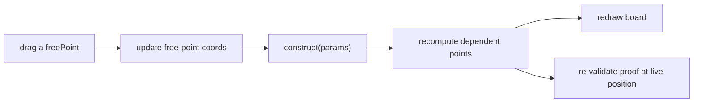

# Movable Freeplay Figures — Design

_Status: planned. The construction model this builds on is **already shipped** (it
powers multi-case verification); this document scopes the remaining UI work to make
the figure itself draggable._

Companion docs: [`../DDAR_ENGINE.md`](../DDAR_ENGINE.md) (verifier internals),
[`../PRD-competitive-freeplay.md`](../PRD-competitive-freeplay.md) (design intent).

---

## 1. Why this is now a small step

The hard part of "movable drawings" is keeping the figure **valid as it moves**:
when a learner drags a point, every dependent point must move so the puzzle's
hypotheses (`given`) still hold. That machinery already exists.

Each puzzle ships:

- `coords` — the canonical realization (realization 0), rendered today.
- `construct(rng)` — a parametric construction: **free** points placed from a
  source of numbers, **dependent** points derived so the givens hold by
  construction. (`src/lib/freeplay/puzzles/*.ts`.)
- `freePoints` — the ids of the free (draggable) points; every other point is
  dependent.

`realize.ts` already calls `construct` repeatedly (with a seeded RNG) to sample
several generic realizations, and `verify()` checks each learner step against all
of them. A movable figure is the same idea with the "RNG" replaced by **the
learner's pointer**: drag a free point, re-run the construction, redraw.



## 2. Required change: construct from explicit parameters

Today `construct(rng: () => number)` invents its own free-point positions. For
dragging we need to **inject** the free-point positions instead. Proposed shared
shape (non-breaking — keep the `rng` form as a thin wrapper):

```ts
// types.ts (sketch)
type FreeParams = Record<PointId, V>; // positions of the free points
interface Puzzle {
  // existing rng form (used by realize.ts) delegates to the param form:
  construct?: (rng: () => number) => Realization;
  // new explicit form for dragging:
  constructFrom?: (free: FreeParams) => Realization;
  freePoints?: PointId[];
}
```

Each puzzle's builder is refactored so the `rng` form samples `FreeParams` and
calls the same core `constructFrom`. (Several builders — `imo2019p2Config`,
`incenterExcenterConfig` — already separate "sample params" from "derive
dependents", so this is mostly mechanical.)

Note: some `freePoints` are constrained (e.g. a point that must stay on a circle).
For those, the UI uses a JSXGraph **glider** so the drag is confined to the locus;
the construction then treats the glider's position as the free parameter.

## 3. Rendering / UI

- Replace the static points in [`figure.ts`](../../src/lib/freeplay/figure.ts) /
  [`FixedFigure.tsx`](../../src/components/freeplay/FixedFigure.tsx) so that
  `freePoints` become draggable points (or gliders on their locus), and dependent
  points are computed (not authored) elements.
- Reuse [`useJSXGraph`](../../src/lib/geometry/useJSXGraph.ts) and the existing
  board element model ([`board-types.ts`](../../src/lib/geometry/board-types.ts));
  course-mode boards already support draggable points and gliders, so the
  primitives exist.
- On `drag`/`up`, read free-point positions → `constructFrom` → update dependent
  point coords → the existing overlay/highlight mechanism still applies.

## 4. Verification while dragging

- Keep multi-case sampling for **accepting** a step (unchanged): a step is only
  accepted if it holds across N sampled realizations.
- Additionally, treat the **live** dragged position as one more realization: re-run
  the established proof against it and show a status ("valid across N positions"),
  giving immediate feedback that the proof is configuration-independent.
- Guard rails: the givens are enforced by `construct`, so a drag can never break a
  hypothesis; degenerate drags (coincident/collinear) are detected by the same
  `isValidRealization` check in [`realize.ts`](../../src/lib/freeplay/realize.ts)
  and the UI snaps back / blocks them.

## 5. Staged plan

- **Stage A — model (done).** `construct(rng)` + `freePoints` on every puzzle;
  multi-case verification in `realize.ts` + `verify.ts`.
- **Stage B — parametric construct + draggable render.** Add `constructFrom(free)`,
  refactor builders to share a core; make `freePoints` draggable/gliders and
  recompute dependents on drag. No verifier change.
- **Stage C — live re-validation + polish.** Re-validate the in-progress proof at
  the live position, surface the "valid across positions" status, handle degenerate
  drags, and add touch/accessibility affordances (larger hit targets, keyboard
  nudge).

## 6. Out of scope

- Auxiliary constructions added mid-proof (a separate roadmap item).
- Free-form sketching / non-parametric figures: movability is always **within** the
  puzzle's construction so the hypotheses are preserved.
